# 100pathfinding-algorithms

[](https://github.com/bailehang/100pathfinding-algorithms/actions/workflows/ci.yml)

I am very interested in further summarizing all the pathfinding algorithms.

## 实现进度 (Implementation Status)

> This repository is progressing toward the long-term goal of implementing **100 pathfinding algorithms**.

**总进度：100 / 100 已实现（100%），其中 100 个附带演示动图。**

```text
IMPLEMENTED   [####################] 100%   100/100
DEMO GIF      [####################] 100%   100/100
```

## Contents

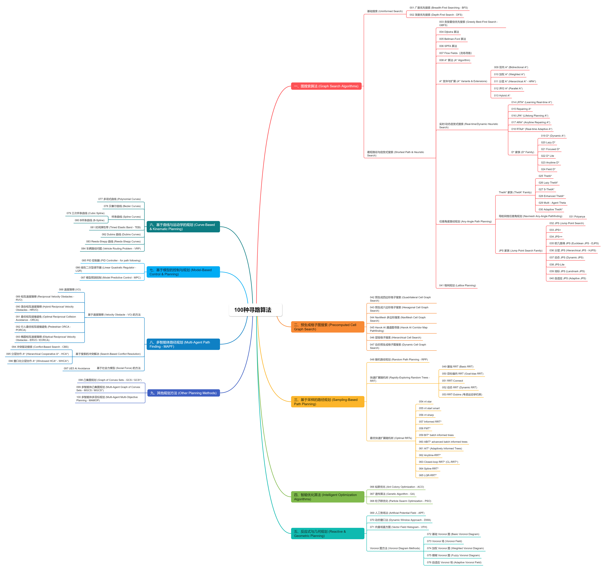


## 一、图搜索算法 (Graph Search Algorithms)

- **基础搜索 (Uninformed Search)**
  - **001 广度优先搜索 (Breadth-First Searching - BFS)**
    - Moore (1959), Lee (1961)
    - 
    - Path length: 54.048; Algorithm time: 13.405 ms
    - 算法心得：
      逐层扩展的搜索策略，它从起始节点开始，逐层向外扩展，直到找到目标节点或遍历完整个搜索空间。
  - **002 深度优先搜索 (Depth-First Search - DFS)**
    - Trémaux (1882), Hopcroft & Tarjan (1973)
    - 
    - Path length: 89.218; Algorithm time: 1.342 ms
    - 算法心得：
      从起始节点开始，沿着一条路径尽可能深入，直到无法继续前进，然后回溯到上一个节点，继续探索其他路径。
- **最短路径与启发式搜索 (Shortest Path & Heuristic Search)**
  - **003 贪婪最佳优先搜索 (Greedy Best-First Search - GBFS)**
    - Doran & Michie (1966), Pearl (1984)
    - 
    - Path length: 67.260; Algorithm time: 5.040 ms
    - 算法心得：
      从起始节点开始，每次选择与目标节点最近的节点进行扩展，直到找到目标节点或遍历完整个搜索空间。
  - **004 Dijkstra 算法**
    - Dijkstra (1959)
    - 
    - Path length: 54.048; Algorithm time: 9.103 ms
    - 算法心得：
      Dijkstra 算法是一种用于寻找最短路径的算法，它通过维护一个距离表来记录从起始节点到其他节点的最短距离。
      算法从起始节点开始，每次选择距离表中距离最小的节点进行扩展，更新其相邻节点的距离表，直到找到目标节点或遍历完整个搜索空间。
  - **005 Bellman-Ford 算法**
    - Bellman (1958), Ford (1956)
    - 
    - Path length: 54.048; Algorithm time: 19.293 ms
    - 算法心得：
      Bellman-Ford 通过反复松弛所有边来求单源最短路径，速度通常慢于 Dijkstra，但可以处理负权边并检测负权环。
  - **006 SPFA 算法**
    - Moore (1959), Bellman-Ford queue optimization
    - 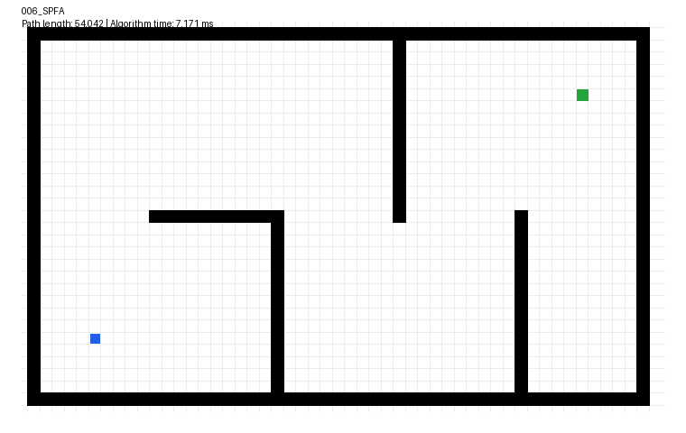
    - Path length: 54.048; Algorithm time: 7.176 ms
    - 算法心得：
      SPFA 使用队列只传播距离发生变化的节点，是 Bellman-Ford 的常见队列优化版本，在许多稀疏图上能减少无效松弛。
  - **007 Flow Fields（流场寻路）**
    - Treuille, Cooper, Popović (2006), 常用于 RTS/Game AI 群体寻路
    - 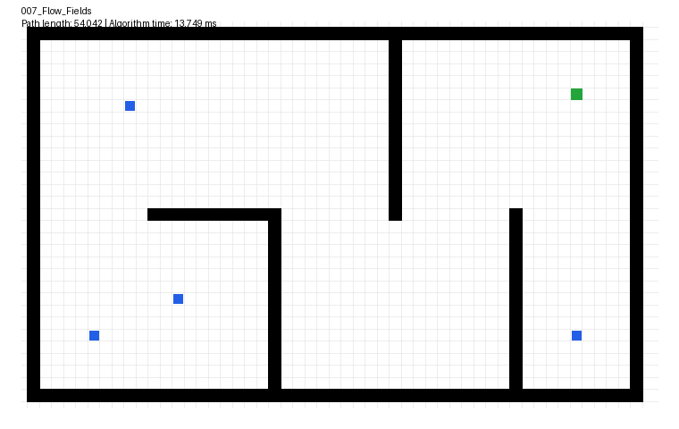
    - Path length: 54.048; Algorithm time: 13.754 ms
    - 算法心得：
      Flow Fields 先从目标点反向传播总代价，得到 integration field，再让每个可行格子指向代价最低的邻居。多个智能体共享同一目标时，只需复用这张方向场即可快速前进。
  - **008 A\* 算法 (A\* Algorithm)**
    - Hart, Nilsson, Raphael (1968)
    - 
    - Path length: 54.048; Algorithm time: 4.961 ms
    - 算法心得：
      A\* 算法是一种启发式搜索算法，它结合了广度优先搜索和贪婪最佳优先搜索的优点。
      算法从起始节点开始，每次选择距离表中距离最小的节点进行扩展，更新其相邻节点的距离表，直到找到目标节点或遍历完整个搜索空间。
  - **A\* 变体与扩展 (A\* Variants & Extensions)**
    - **009 双向 A\* (Bidirectional A\*)**
      - Pohl (1971)
      - 
      - Path length: 54.048; Algorithm time: 3.563 ms
      - 算法心得：
        它从起始节点和目标节点同时开始进行搜索，直到两个搜索方向相遇。
    - **010 加权 A\* (Weighted A\*)**
      - Pohl (1970)
      - 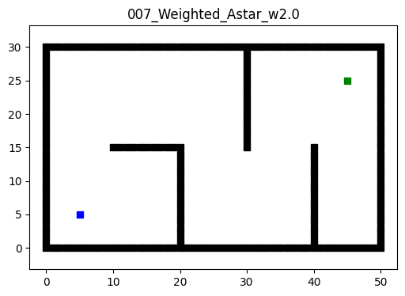
      - Path length: 57.360; Algorithm time: 6.077 ms
      - 算法心得：
        加权 A\* 算法是 A\* 算法的一种变体，它通过对每个节点的代价进行加权来调整搜索过程。
    - **011 分层 A\* (Hierarchical A\* - HPA\*)**
      - Botea, Müller, Schaeffer (2004)
      - 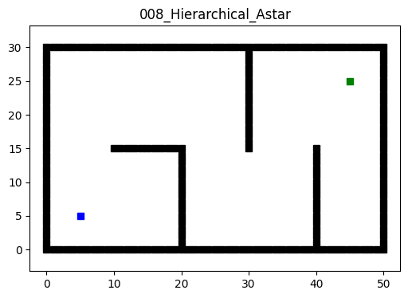
      - Path length: 51.637; Algorithm time: 2.379 ms
      - 算法心得：
        分层 A\* 算法是 A\* 算法的一种变体，它将搜索空间划分为多个层次，每个层次使用 A\* 算法进行搜索。这里展示两个层次。
    - **012 并行 A\* (Parallel A\*)**
      - Zhou & Zeng (2015)
      - 
      - Path length: total 147.089, avg 47.366, n=3; Algorithm time: 60.810 ms
      - 算法心得：
        并行 A\* 算法的优点是可以利用多核处理器的并行计算能力，加快搜索速度。这里难以展示这种并行改为展示多个终点复用查询路径的情况
    - **013 Hybrid A\***
      - Dolgov, Thrun, Montemerlo, Diebel (2008)
      - 
      - 算法心得：
        混合 A\* 算法有运动约束的寻路，比如汽车的运动约束，
  - **实时/动态启发式搜索 (Real-time/Dynamic Heuristic Search)**
    - **014 LRTA\* (Learning Real-time A\*)**
      - Korf (1990)
      - 
      - 算法心得：
        学习式 A\* 算法是 A\* 算法的一种变体，它通过学习来调整搜索过程。
    - **015 Repairing A\***
      - Stentz (1994)
      - 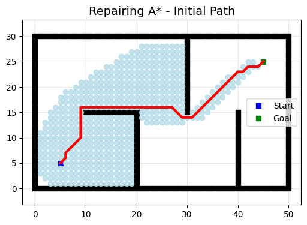
      - 算法心得：
        修复 A\* 算法是 A\* 算法的一种变体，也是D\*，动态环境下它通过修复搜索过程中的错误来提高搜索效率。
    - **016 LPA\* (Lifelong Planning A\*)**
      - Koenig, Likhachev, Furcy (2004)
      - 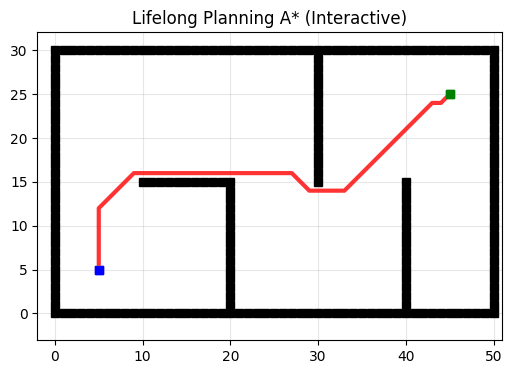
      - 算法心得：
        终身规划 A\* 算法是 A\* 算法的一种变体，它可以在不断变化的环境中进行搜索。
    - **017 ARA\* (Anytime Repairing A\*)**
      - Likhachev, Gordon, Thrun (2003)
      - 
      - 算法心得：
        anytime Repairing A\* 算法是 A\* 算法的一种变体，初始权重较大，路径接近 “次优解”，算法的 “修复” 机制多次调整，self.e -= 0.5。
    - **018 RTAA\* (Real-time Adaptive A\*)**
      - Koenig & Likhachev (2006)
      - 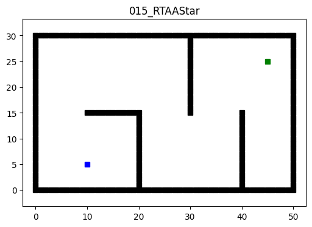
      - 算法心得：
        实时自适应 A\* 算法是 A\* 算法的一种变体，它可以在不断变化的环境中进行搜索。
    - **D\* 家族 (D\* Family)**
      - **019 D\* (Dynamic A\*)**
        - Stentz (1994)
        - 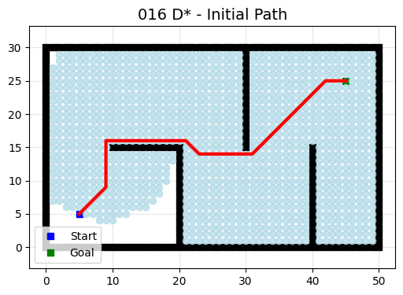
        - 算法心得：
          也叫做动态 A\* 算法
      - **020 Lazy D\***
        - Koenig, Likhachev, Furcy (2004)
        - 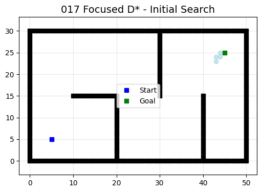
        - 注：该 GIF 文件名为历史遗留命名，当前归属 020 Lazy D\* 演示。
      - **021 Focused D\***
        - Stentz (1995)
        - 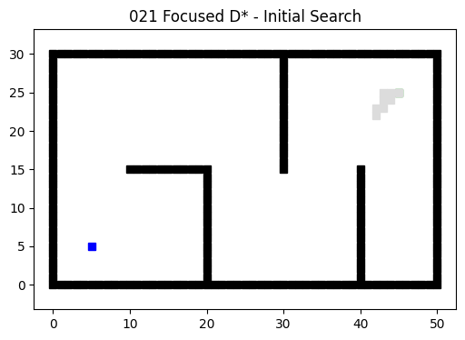
      - **022 D\* Lite**
        - Koenig & Likhachev (2002)
        - 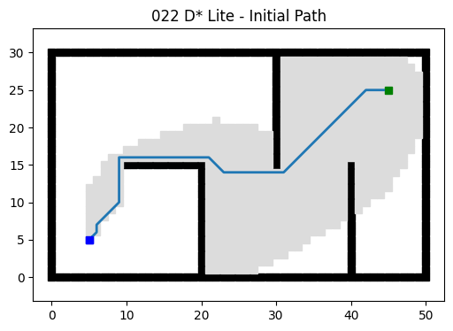
      - **023 Anytime D\***
        - Likhachev, Ferguson, Gordon, Stentz, Thrun (2005)
        - 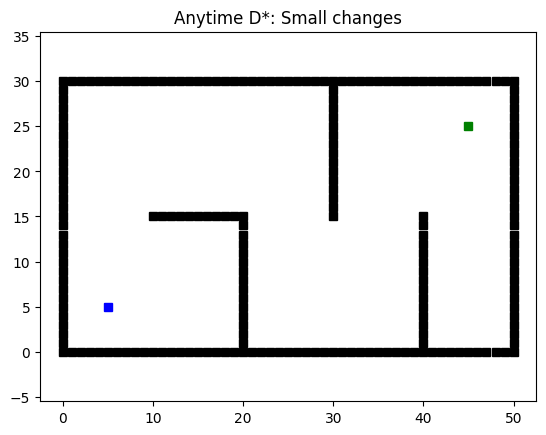
      - **024 Field D\***
        - Ferguson & Stentz (2007)
        - 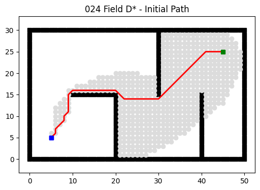
  - **任意角度路径规划 (Any-Angle Path Planning)**
    - **ThetA\* 家族 (ThetA\* Family)**
      - **025 ThetA\***
        - Nash, Daniel, Koenig, Felner (2007)
        - 
      - **026 Lazy ThetA\***
        - Nash, Koenig, Tovey (2010)
        - 
      - **027 S-ThetA\***
        - Tang, Chen, Wu, Zhang, Chen (2021)
        - 
      - **028 Enhanced ThetA\***
        - Li, Wen, Wang, Zhang (2020)
        - 
      - **029 Multi - Agent Theta**
        - Li, Zhang, Wang, Zhang (2022)
        - 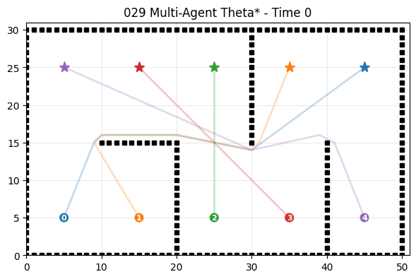
      - **030 Adaptive ThetA\***
        - Ferguson & Stentz (2006)
        - 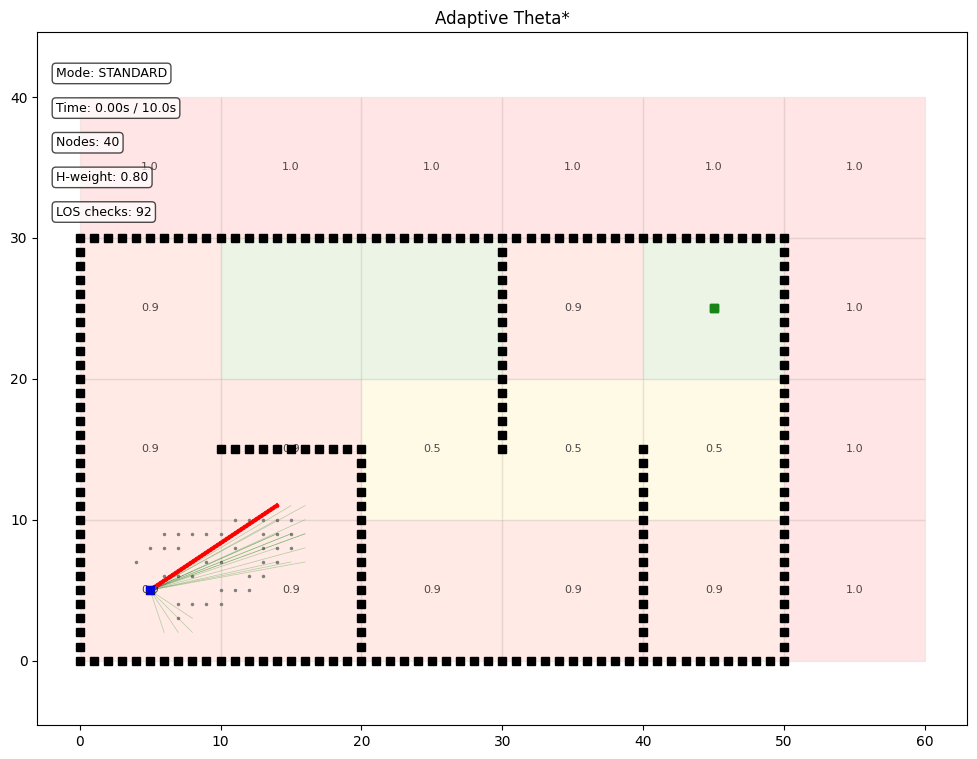
    - **导航网格任意角规划 (Navmesh Any-Angle Pathfinding)**
      - **031 Polyanya**
        - Cui, Harabor, Grastien (2017)
        - 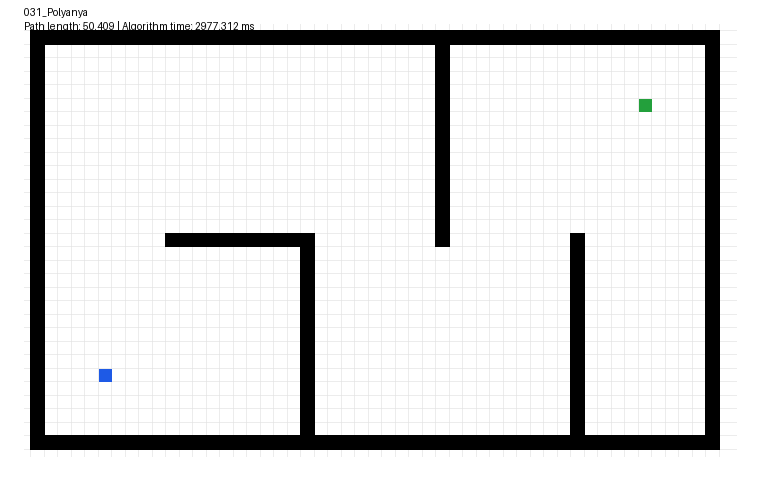
        - 算法心得：
          Polyanya 在导航网格上搜索“根点 + 边界区间”，用可见区间传播代替逐格扩展，可得到更接近连续空间最短路径的任意角路线。
    - **JPS 家族 (Jump Point Search Family)**
      - **032 JPS (Jump Point Search)**
        - Harabor & Grastien (2011)
        - 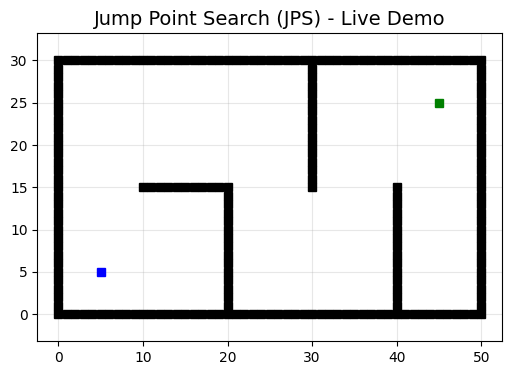
      - **033 JPS+**
        - Harabor & Grastien (2012)
        - 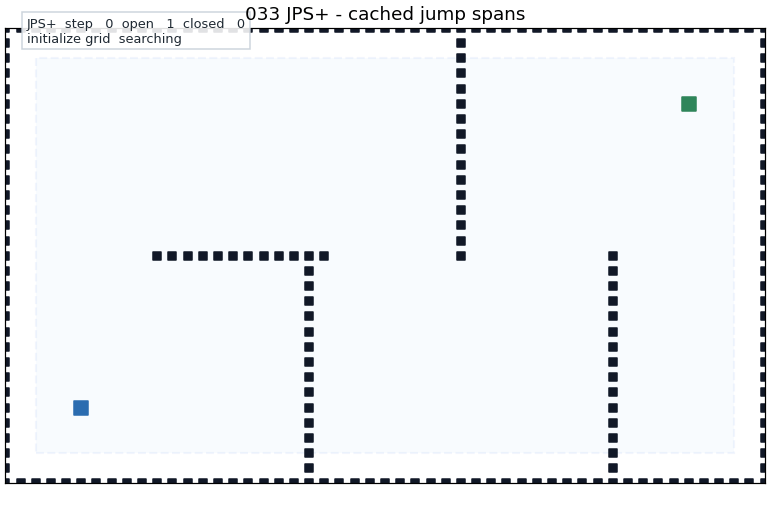
      - **034 JPS++**
        - Pochter, Zohar, Rosenschein, Sturtevant (2012)
        - 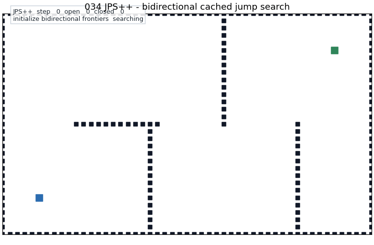
      - **035 欧几里得 JPS (Euclidean JPS - EJPS)**
        - Strasser, Botea, Harabor (2016)
        - 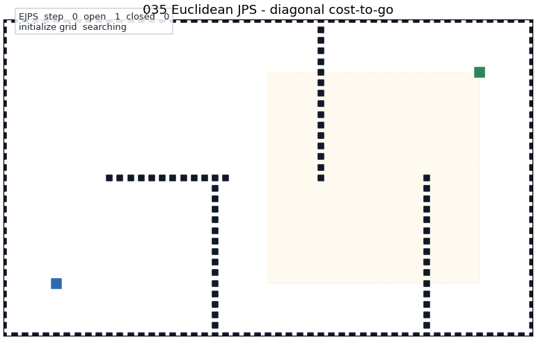
      - **036 分层 JPS (Hierarchical JPS - HJPS)**
        - Harabor & Grastien (2014)
        - 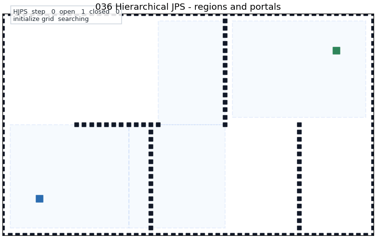
      - **037 动态 JPS (Dynamic JPS)**
        - Papadakis (2013)
        - 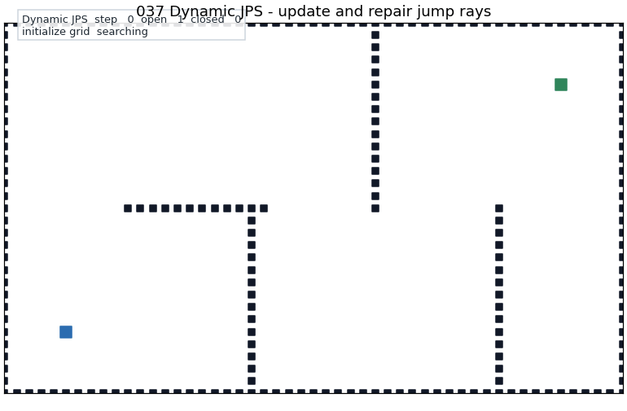
      - **038 JPS-Lite**
        - Gong, Zhang, Wang, Wang (2019)
        - 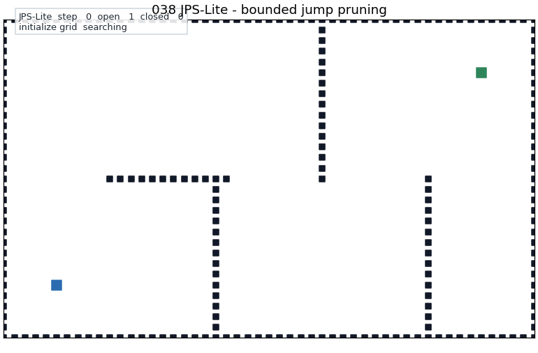
      - **039 地标 JPS (Landmark JPS)**
        - 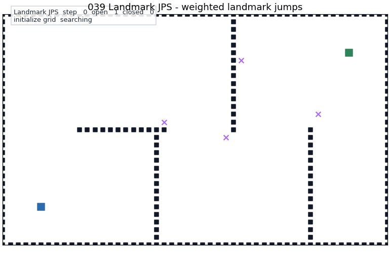
      - **040 自适应 JPS (Adaptive JPS)**
        - Su, Hsueh (2016)
        - 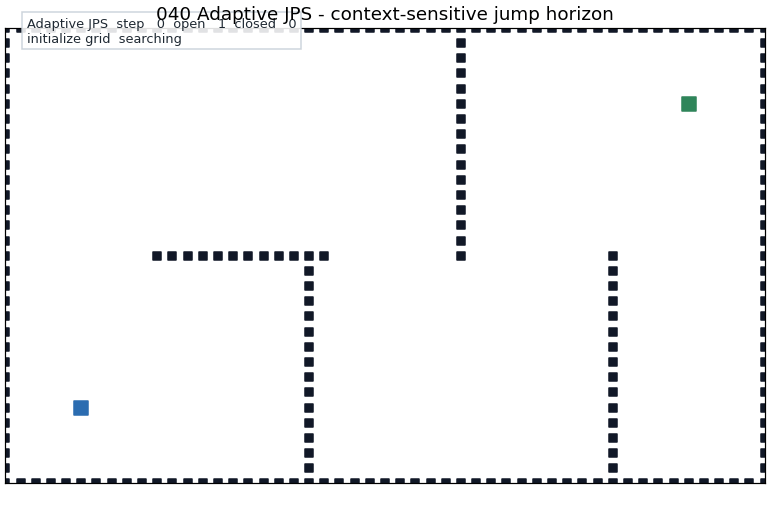
  - **041 格网规划 (Lattice Planning)**
    - Pivtoraiko, Kelly (2005), Likhachev & Ferguson (2009)
    - 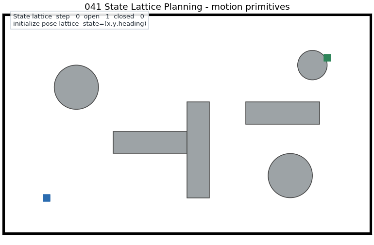

## 二、预生成格子图搜索 (Precomputed Cell Graph Search)

- **042 预生成四边形格子搜索 (Quadrilateral Cell Graph Search)**
  - A* over tightly tiled precomputed quadrilateral cells
  - 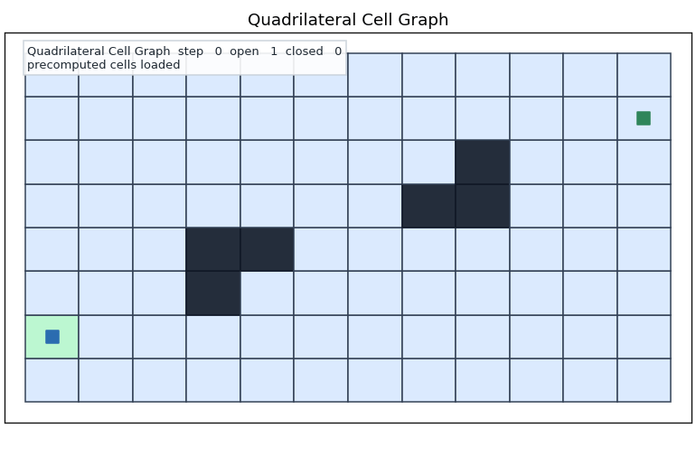
- **043 预生成六边形格子搜索 (Hexagonal Cell Graph Search)**
  - A* over tightly packed six-neighbor hexagonal cells
  - 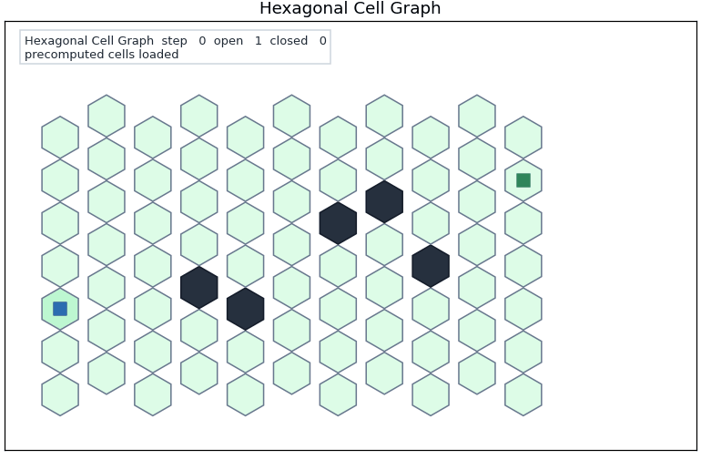
- **044 NavMesh 多边形搜索 (NavMesh Cell Graph Search)**
  - Delaunay triangulation around two circular obstacles, then merge triangles into 3-6 sided convex navmesh polygons
  - 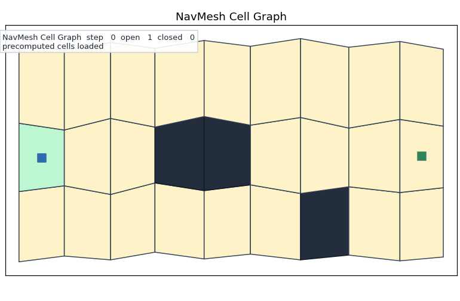
- **045 Havok AI 通道图寻路 (Havok AI Corridor Map Pathfinding)**
  - Havok AI style navmesh corridor, portal sequence, and funnel/string-pulling path extraction
  - 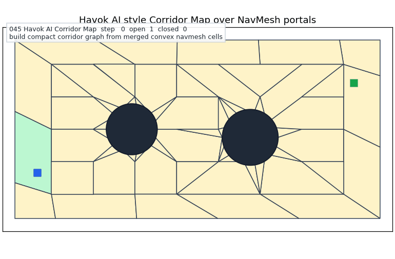
  - Path length: 47.513; Algorithm time: 13.523 ms
  - 算法心得：
    Corridor Map 不直接在每个点上搜索，而是先在 NavMesh 多边形之间找到一串 corridor cells，再通过共享 portal 和 funnel/string-pulling 得到贴合通道的连续路径。
- **046 层级格子搜索 (Hierarchical Cell Search)**
  - Aggregate cells into cluster/region graph, search regions first, then refine cells
  - 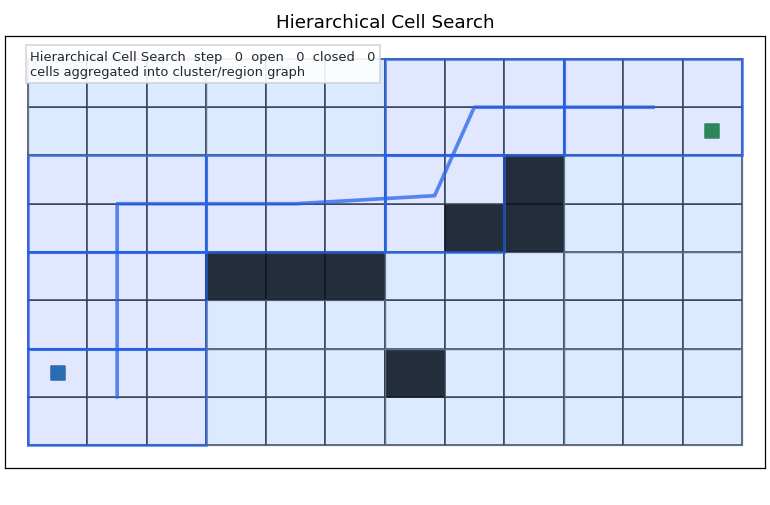
- **047 动态预生成格子图搜索 (Dynamic Cell Graph Search)**
  - Incremental repair after precomputed cells become blocked or traversal costs change
  - 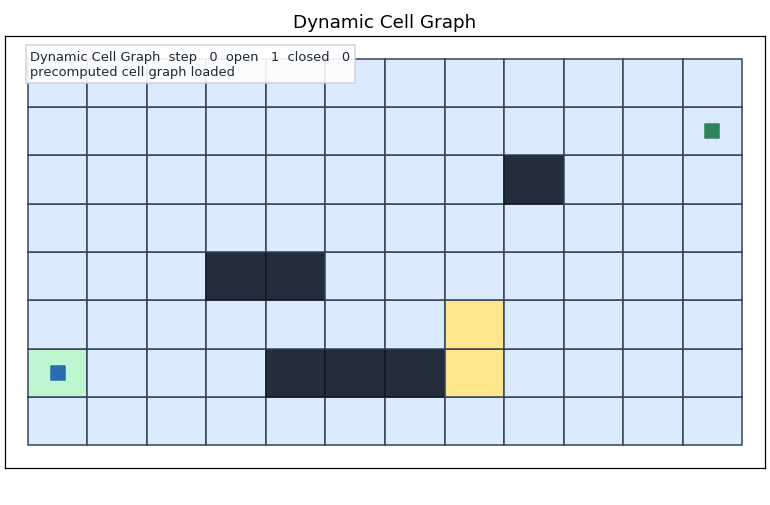

## 三、基于采样的路径规划 (Sampling-Based Path Planning)

- **048 随机路径规划 (Random Path Planning - RPP)**
  - Barraquand & Latombe (1991)
  - 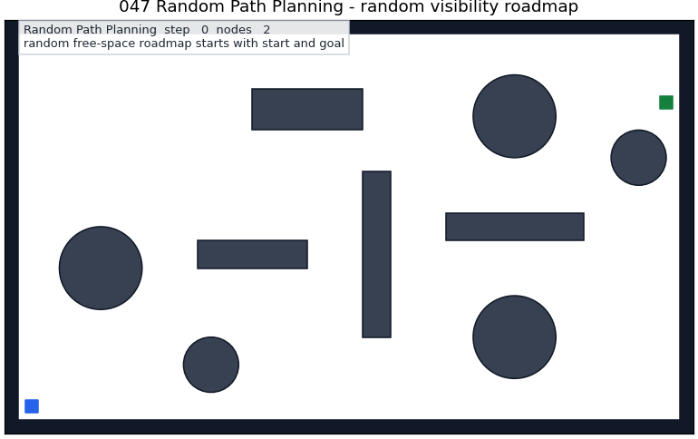
  - Path length: 63.052; Algorithm time: 3734.890 ms
  - 算法心得：
    通过随机采样自由空间节点并连接可见邻居，逐步形成随机路网；随后在路网上搜索可行路径，适合展示随机采样如何绕开复杂障碍。
- **快速扩展随机树 (Rapidly-Exploring Random Trees - RRT)**
  - **049 基础 RRT (Basic RRT)**
    - LaValle (1998)
    - 
  - **050 目标偏向 RRT (Goal-bias RRT)**
    - LaValle & Kuffner (2001)
    - 
  - **051 RRT-Connect**
    - Kuffner & LaValle (2000)
    - 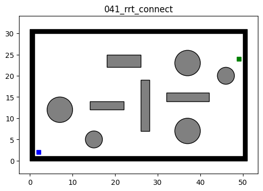
  - **052 动态 RRT (Dynamic RRT)**
    - Ferguson, Howard, Likhachev (2008)
    - 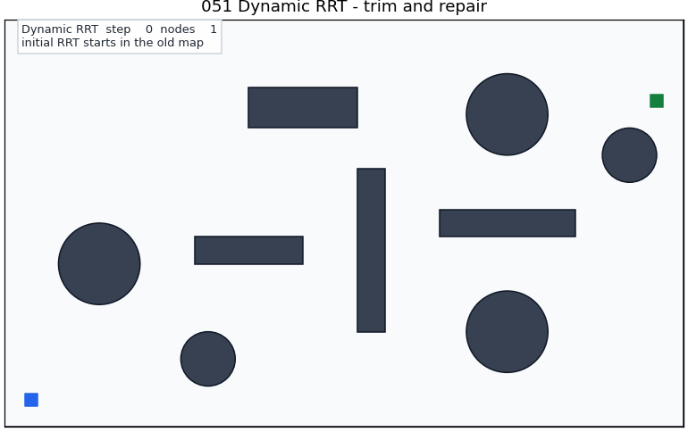
    - Path length: 78.887; Algorithm time: 3870.116 ms
    - 算法心得：
      Dynamic RRT 先保留旧地图中的随机树和路径，环境变化后标记被新障碍截断的边，剪掉失效子树，再从剩余有效树继续修复到目标。
  - **053 RRT-Dubins (考虑运动学约束)**
    - LaValle & Kuffner (2001) (Dubins with RRT)
    - 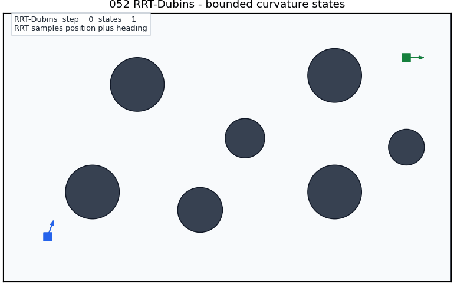
    - Path length: 63.973; Algorithm time: 7890.028 ms
    - 算法心得：
      RRT-Dubins 将节点扩展到 `(x, y, yaw)` 状态空间，每条边必须满足最大曲率约束，因此路径会呈现连续转向而不是任意折线。
- **最优快速扩展随机树 (Optimal RRTs)**
  - **054 rrt star**
    - Karaman & Frazzoli (2011)
    - 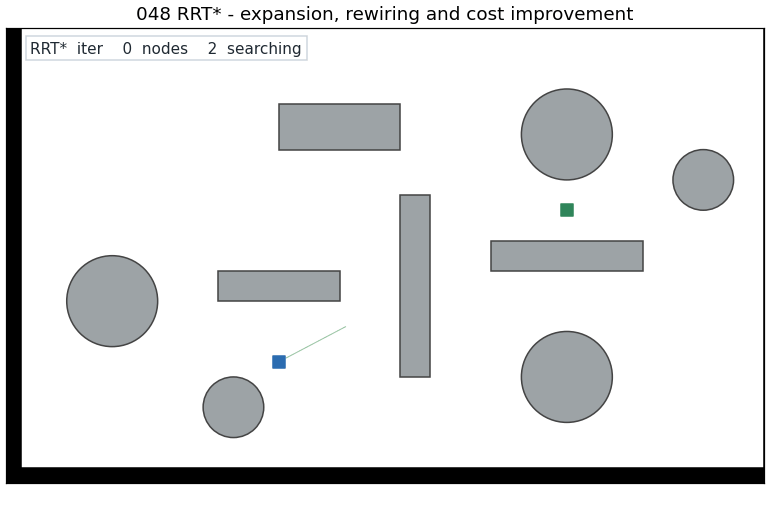
  - **055 rrt start smart**
    - Nasir, K., et al. (2013)
    - 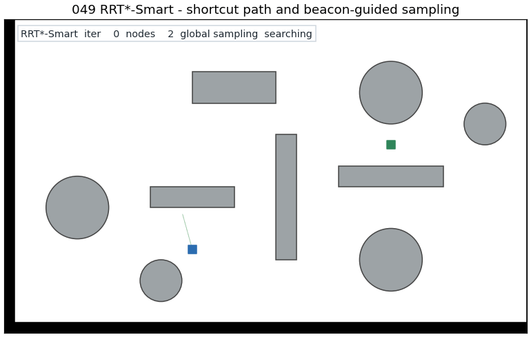
  - **056 rrt sharp**
    - Otte & Frazzoli (2014)
    - 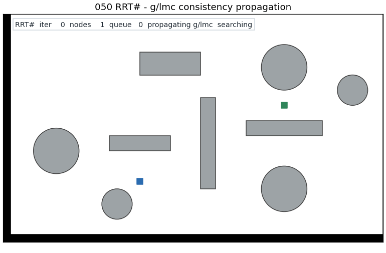
  - **057 Informed RRT\***
    - Gammell, Srinivasa & Barfoot (2014)
    - 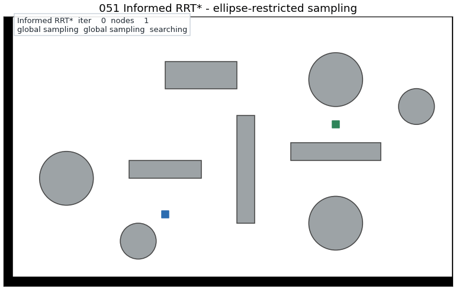
  - **058 FMT\***
    - Janson, Schmerling, Clark & Pavone (2015)
    - 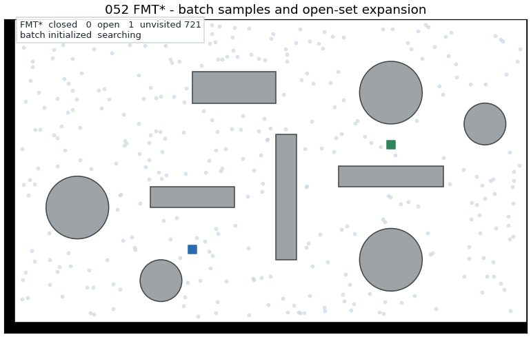
  - **059 BIT\* batch informed trees**
    - Gammell, Srinivasa & Barfoot (2015)
    - 
  - **060 ABIT\* advanced batch informed trees**
    - Strub & Gammell (2020)
    - 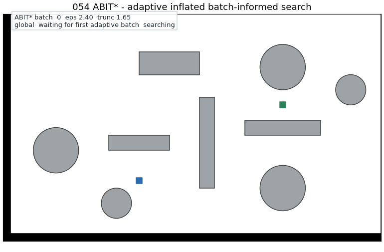
  - **061 AIT\* (Adaptively Informed Trees)**
    - Strub & Gammell (2020)
    - 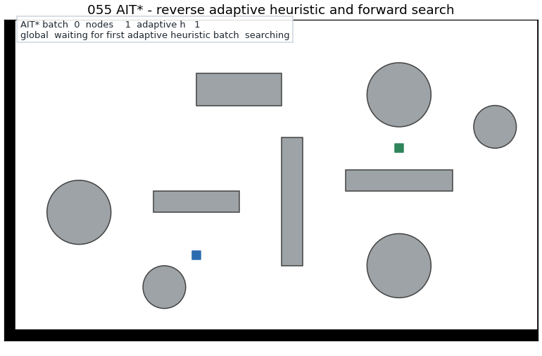
  - **062 Anytime-RRT\***
    - Karaman, Walter, Perez, Frazzoli & Teller (2011)
    - 
  - **063 Closed-loop RRT\* (CL-RRT\*)**
    - Luders, Kothari & How (2010)
    - 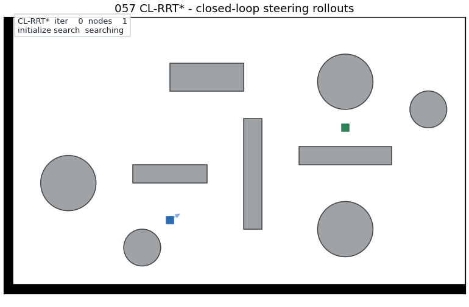
  - **064 Spline-RRT\***
    - Lee, Song & Shim (2014)
    - 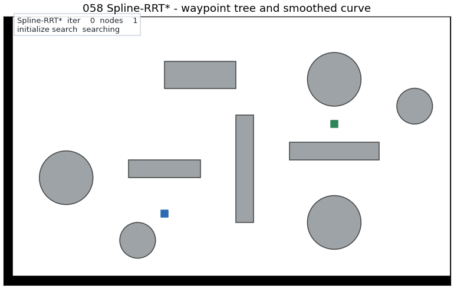
  - **065 LQR-RRT\***\*
    - Perez, Platt, Konidaris, Kaelbling & Lozano-Perez (2012)
    - 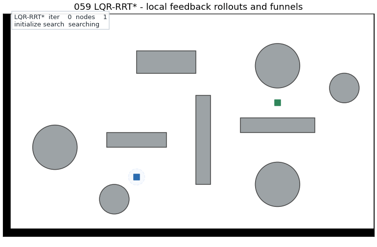

## 四、智能优化算法 (Intelligent Optimization Algorithms)

- **066 蚁群优化 (Ant Colony Optimization - ACO)**
  - Dorigo, Maniezzo, Colorni (1991, 1996), Dorigo & Di Caro (1999)
  - 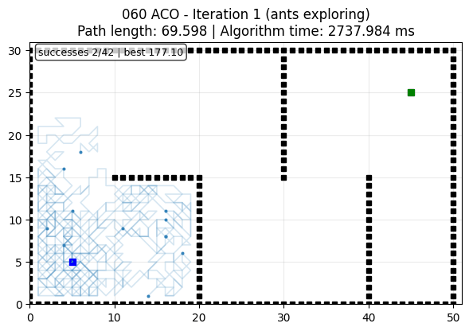
- **067 遗传算法 (Genetic Algorithm - GA)**
  - Holland (1975/1992)
  - 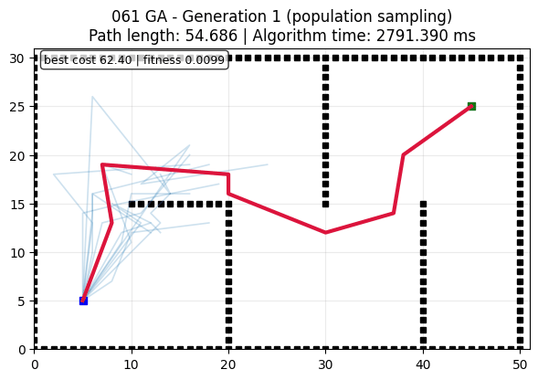
- **068 粒子群优化 (Particle Swarm Optimization - PSO)**
  - Kennedy & Eberhart (1995)
  - 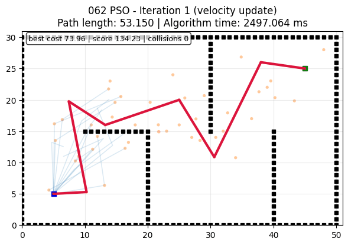

## 五、反应式与几何规划 (Reactive & Geometric Planning)

- **069 人工势场法 (Artificial Potential Field - APF)**
  - Khatib (1986)
  - 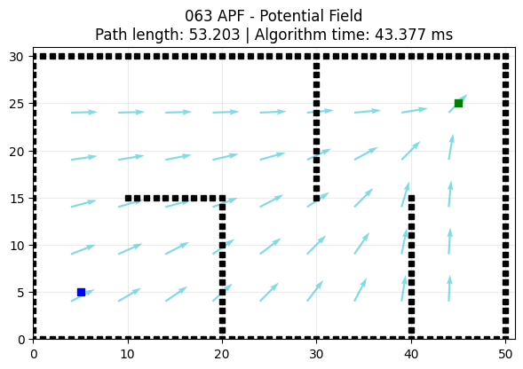
- **070 动态窗口法 (Dynamic Window Approach - DWA)**
  - Fox, Burgard, Thrun (1997)
  - 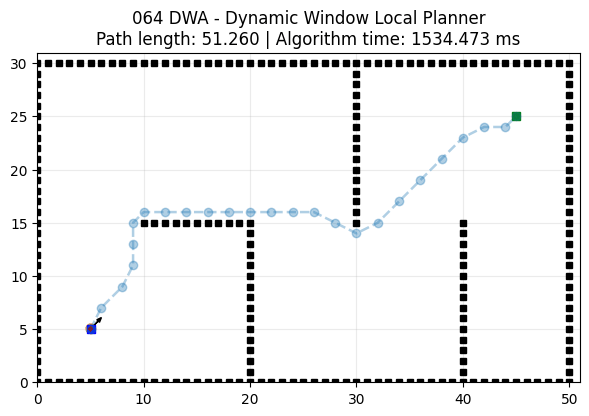
- **071 向量场直方图 (Vector Field Histogram - VFH)**
  - Borenstein & Koren (1991)
  - 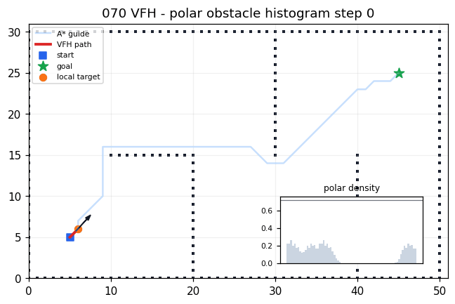
  - Path length: 53.450; Algorithm time: 24.365 ms
  - 算法心得：
    VFH 将局部障碍投影成极坐标直方图，在可通行扇区中选择最接近局部目标的方向，适合展示反应式避障和全局引导的结合。
- **Voronoi 图方法 (Voronoi Diagram Methods)**
  - **072 基础 Voronoi 图 (Basic Voronoi Diagram)**
    - Voronoi (1908), Shamos & Hoey (1975)
    - 
  - **073 Voronoi 场 (Voronoi Field)**
    - Okabe, Boots, Sugihara, Chiu (2000)
    - 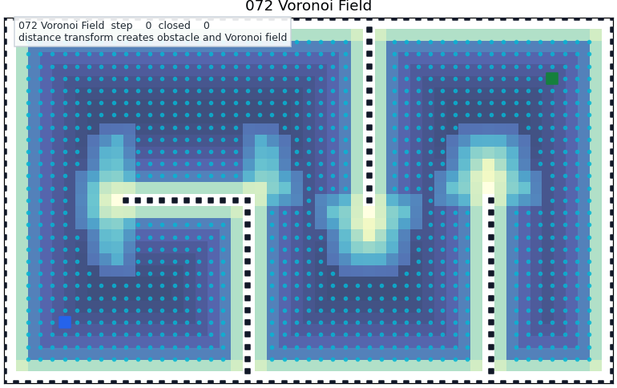
    - Path length: 55.698; Algorithm time: 3786.940 ms
    - 算法心得：
      Voronoi Field 用障碍距离场和 Voronoi ridge 构造连续代价，路径不会只贴最短线，而会主动远离障碍边界。
  - **074 加权 Voronoi 图 (Weighted Voronoi Diagram)**
    - Aurenhammer & Edelsbrunner (1984)
    - 
    - Path length: 55.698; Algorithm time: 4064.387 ms
    - 算法心得：
      Weighted Voronoi 为不同区域赋予不同障碍影响权重，使路径在同样的 Voronoi 结构上偏向代价更低、更安全的通道。
  - **075 模糊 Voronoi 图 (Fuzzy Voronoi Diagram)**
    - Jooyandeh, Mohades Khorasani (2008)
    - 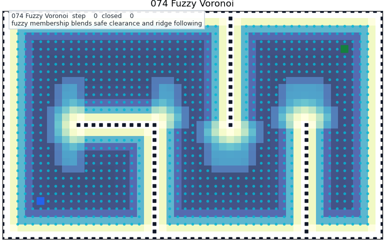
    - Path length: 57.698; Algorithm time: 3838.347 ms
    - 算法心得：
      Fuzzy Voronoi 用软隶属度混合“离障碍远”和“靠近 Voronoi ridge”，避免硬阈值导致路径突然切换。
  - **076 自适应 Voronoi 场 (Adaptive Voronoi Field)**
    - Garrido, Moreno, Blanco, Medina (2010)
    - 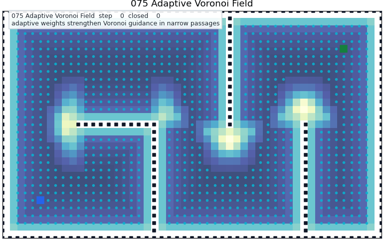
    - Path length: 55.698; Algorithm time: 3961.134 ms
    - 算法心得：
      Adaptive Voronoi Field 根据局部通道宽度调整 ridge 吸引力，在狭窄区域更强调居中通过，在开阔区域允许更直接地朝目标推进。

## 六、基于曲线与运动学的规划 (Curve-Based & Kinematic Planning)

- **077 多项式曲线 (Polynomial Curves)**
  - Richter, Bry, Roy (2013)
  - 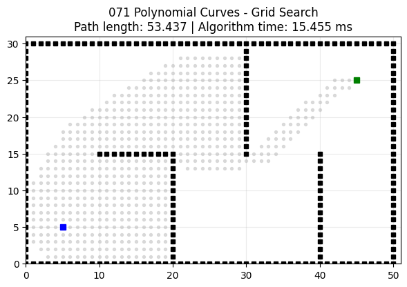
- **078 贝塞尔曲线 (Bezier Curves)**
  - Bezier (1960s), Forrest (1972)
  - 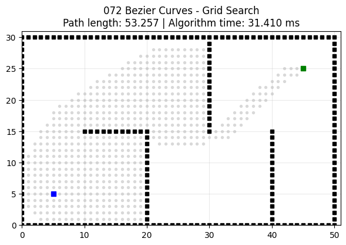
- **样条曲线 (Spline Curves)**
  - **079 三次样条曲线 (Cubic Spline)**
    - Ahlberg, Nilson, Walsh (1967)
    - 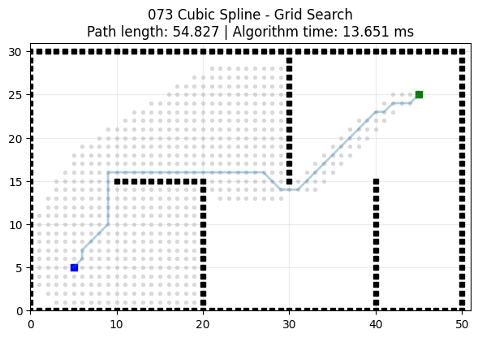
  - **080 B样条曲线 (B-Spline)**
    - de Boor (1972), Cox (1972)
    - 
- **081 时间弹性带 (Timed Elastic Band - TEB)**
  - Rösmann, Hoffmann, Bertram (2012, 2017)
  - 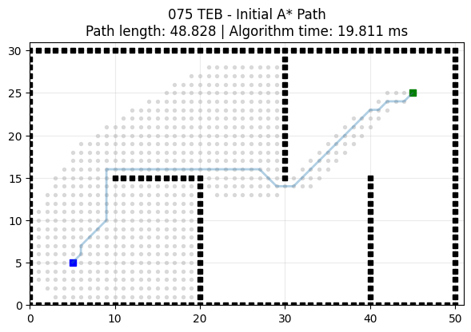
- **082 Dubins 曲线 (Dubins Curves)**
  - Dubins (1957)
  - 
- **083 Reeds-Shepp 曲线 (Reeds-Shepp Curves)**
  - Reeds & Shepp (1990)
  - 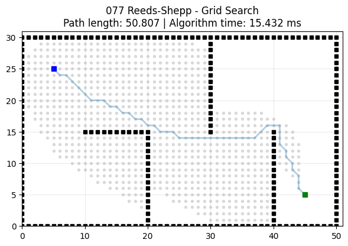
- **084 车辆路径问题 (Vehicle Routing Problem - VRP)**
  - Dantzig & Ramser (1959)
  - 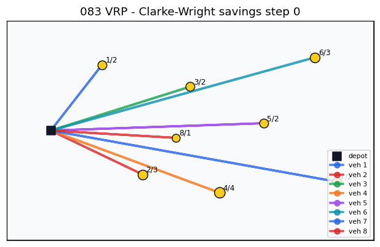
  - Path length: total 199.023, avg 66.341, n=3; Algorithm time: 0.119 ms
  - 算法心得：
    VRP 在单条最短路之外加入车辆容量和客户分配约束，Clarke-Wright savings 合并过程直观展示了从单客户路线到多车配送方案的构造。

## 七、基于模型的控制与规划 (Model-Based Control & Planning)

- **085 PID 控制器 (PID Controller - for path following)**
  - Minorsky (1922), Ziegler & Nichols (1942)
  - 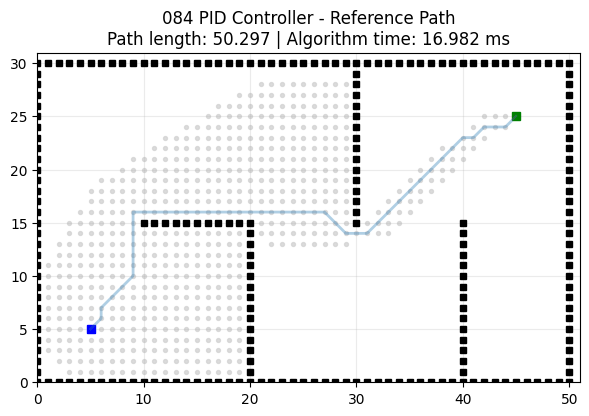
  - Path length: 50.297; Algorithm time: 16.358 ms
  - 算法心得：
    PID 路径跟踪把规划出的参考路径转成连续控制问题，比例项快速修正朝向误差，积分项消除稳态偏差，微分项抑制转向振荡。
- **086 线性二次型调节器 (Linear Quadratic Regulator - LQR)**
  - Kalman (1960)
  - 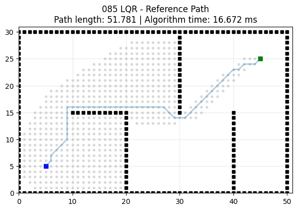
  - Path length: 51.781; Algorithm time: 16.529 ms
  - 算法心得：
    LQR 将横向误差和航向误差写成线性状态反馈，通过二次代价权衡跟踪精度与转向输入，适合展示稳定、平滑的最优反馈控制。
- **087 模型预测控制 (Model Predictive Control - MPC)**
  - Cutler & Ramaker (1980), Garcia, Prett, Morari (1989)
  - 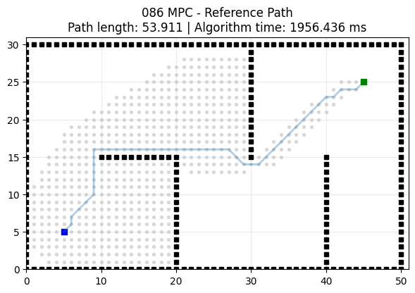
  - Path length: 53.911; Algorithm time: 1956.238 ms
  - 算法心得：
    MPC 每一步都向前滚动预测多个候选控制序列，用有限时域代价选择当前控制，能把跟踪误差、控制平滑度和未来约束放在同一个优化框架里。

## 八、多智能体路径规划 (Multi-Agent Path Finding - MAPF)

- **基于速度障碍 (Velocity Obstacle - VO) 的方法**
  - **088 速度障碍 (VO)**
    - Fiorini & Shiller (1998)
    - 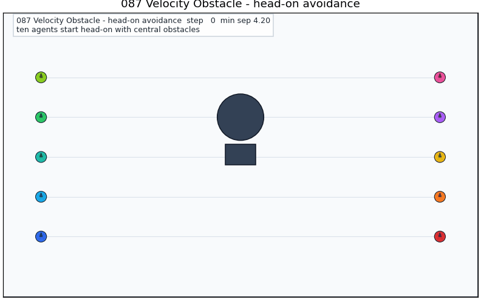
    - Path length: total 448.060, avg 44.806, n=10; Algorithm time: 7960.935 ms
    - 算法心得：
      10 个智能体左右相向穿越同一通道，VO 让每个智能体独立避开预测速度障碍，适合作为后续 reciprocal 方法的基线对比。
  - **089 相互速度障碍 (Reciprocal Velocity Obstacles - RVO)**
    - van den Berg, Lin, Manocha (2008)
    - 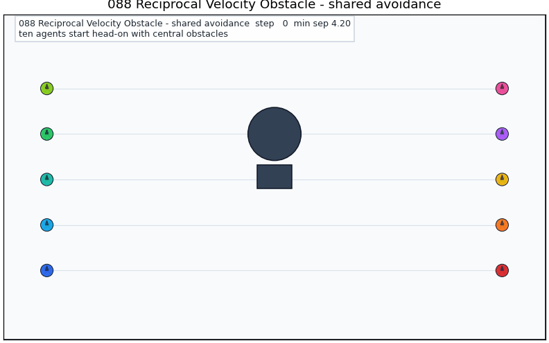
    - Path length: total 441.718, avg 44.172, n=10; Algorithm time: 7834.005 ms
    - 算法心得：
      RVO 将避让责任在相向智能体之间分摊，比单边 VO 更容易形成双方同时让行的轨迹。
  - **090 混合相互速度障碍 (Hybrid Reciprocal Velocity Obstacles - HRVO)**
    - Snape, van den Berg, Guy, Manocha (2011)
    - 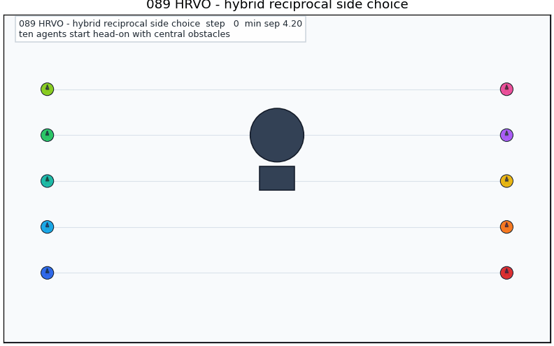
    - Path length: total 430.937, avg 43.095, n=10; Algorithm time: 8445.856 ms
    - 算法心得：
      HRVO 在 reciprocal 思路上加入混合侧向选择，减少双方对称避让时的左右摇摆。
  - **091 最优相互碰撞避免 (Optimal Reciprocal Collision Avoidance - ORCA)**
    - van den Berg, Guy, Lin, Manocha (2008, 2011)
    - 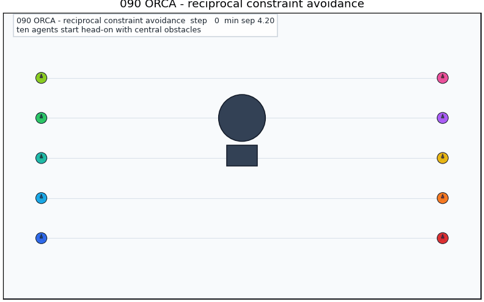
    - Path length: total 446.853, avg 44.685, n=10; Algorithm time: 7746.566 ms
    - 算法心得：
      ORCA 用近似半平面约束筛选速度，在中间障碍和迎面人流叠加时保持更稳定的安全间距。
  - **092 行人最优相互碰撞避免 (Pedestrian ORCA - PORCA)**
    - Luo, Cai, Bera, Hsu, Lee, Manocha (2018)
    - 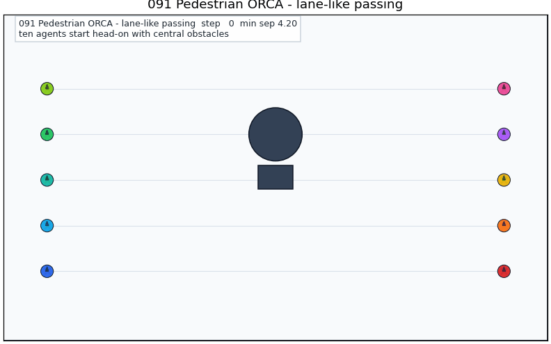
    - Path length: total 422.992, avg 42.299, n=10; Algorithm time: 8686.551 ms
    - 算法心得：
      PORCA 加入行人式侧向偏好和速度调制，更像人群在窄通道里自然分流通过。
  - **093 椭圆相互速度障碍 (Elliptical Reciprocal Velocity Obstacles - ERVO / EORCA)**
    - Best, Narang, Manocha (2016)
    - 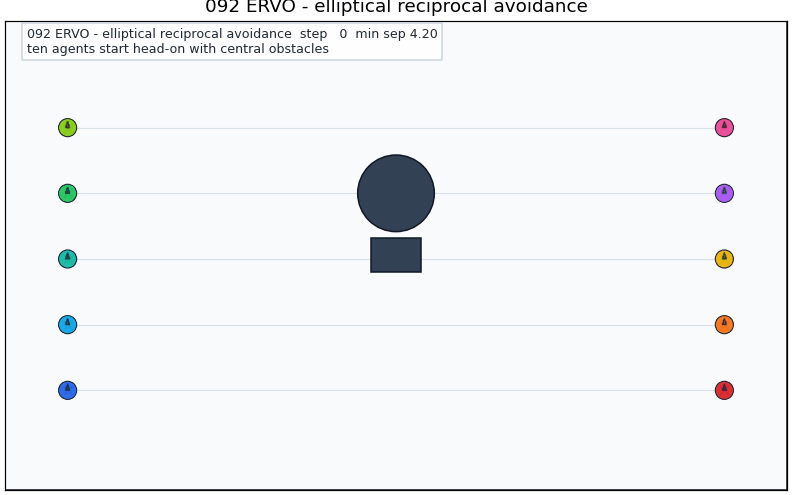
    - Path length: total 425.009, avg 42.501, n=10; Algorithm time: 8299.813 ms
    - 算法心得：
      ERVO 用椭圆速度障碍表达迎面运动的非圆形风险区，能更早对正面会车做出侧向避让。
- **基于搜索的冲突解决 (Search-Based Conflict Resolution)**
  - **094 冲突驱动搜索 (Conflict-Based Search - CBS)**
    - Sharon, Stern, Felner, Sturtevant (2012, 2015)
  - **095 分层协作 A\* (Hierarchical Cooperative A\* - HCA\*)**
    - Silver (2005)
  - **096 窗口化分层协作 A\* (Windowed HCA\* - WHCA\*)**
    - Silver (2005)
    - 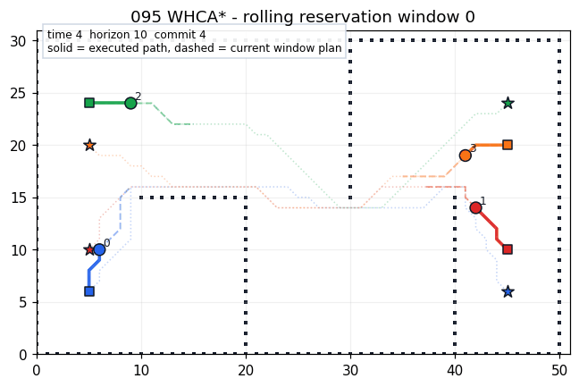
    - Path length: total 199.196, avg 49.799, n=4; Algorithm time: 18.867 ms
    - 算法心得：
      WHCA\* 在上层 guide 的约束下只规划有限时间窗，并把近期 cell/edge 写入预约表，适合把多智能体冲突处理拆成反复滚动的小问题。
- **基于社会力模型 (Social Force) 的方法**
  - **097 UE5 AI Avoidance**
    - UE5 MassAI MassAvoidanceProcessors (2023)
    - 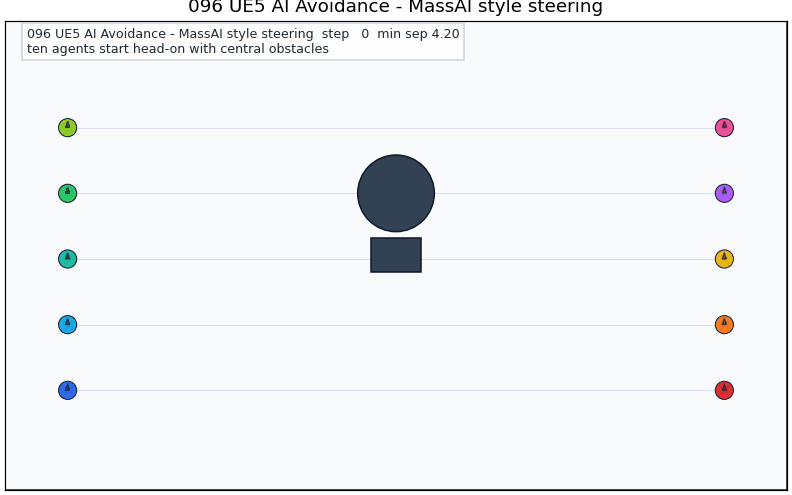
    - Path length: total 439.950, avg 43.995, n=10; Algorithm time: 8219.779 ms
    - 算法心得：
      UE5 AI Avoidance 风格的局部转向把目标速度、分离力、障碍避让和速度平滑组合在一起，更贴近运行时大量智能体的连续避让管线。

## 九、其他规划方法 (Other Planning Methods)

- **098 凸集图规划 (Graph of Convex Sets - GCS / GCS\*)**
  - Marcucci, Tedrake (2019), Chia, Jiang, Graesdal, Kaelbling, Tedrake (2024)
  - 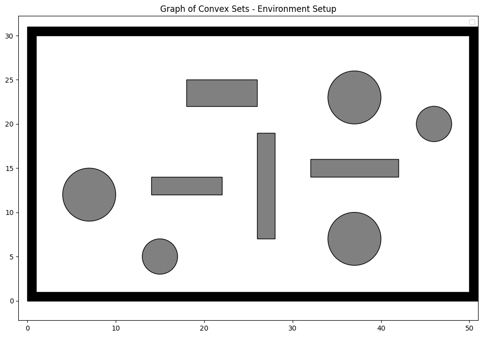
- **099 多智能体凸集图规划 (Multi-Agent Graph of Convex Sets - MGCS / MGCS\*)**
  - Marcucci, Tedrake (2019), Chia, Jiang, Graesdal, Kaelbling, Tedrake (2024)
  - 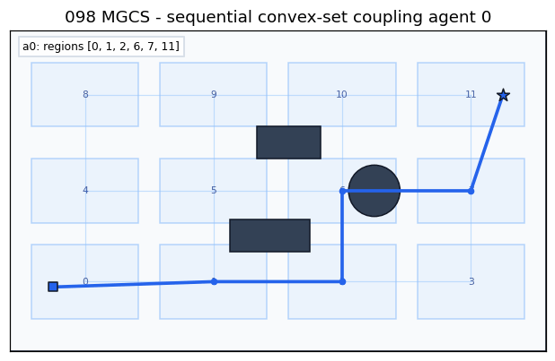
  - Path length: total 169.456, avg 56.485, n=3; Algorithm time: 0.059 ms
  - 算法心得：
    MGCS 将每个智能体的连续运动约束映射到凸区域图上，并通过共享区域惩罚让多条路线在同一凸集网络内分流。
- **100 多智能体多目标规划 (Multi-Agent Multi-Objective Planning - MAMOP)**
  - Chia, Jiang, Graesdal, Kaelbling, Tedrake (2024)
  - 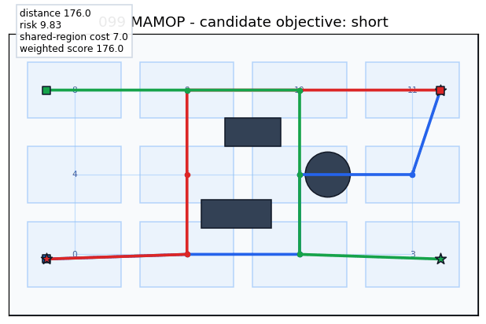
  - Path length: total 176.012, avg 58.671, n=3; Algorithm time: 0.274 ms
  - 算法心得：
    MAMOP 把距离、安全风险和共享区域拥堵放入同一个多目标比较过程，演示了从候选 Pareto 方案中选择折中解的流程。

---
### 逐算法实现状态明细 (per-algorithm status)

**一、图搜索算法 (Graph Search)**

|  #  | 算法                       |  状态 |    #   | 算法                         |   状态   |
| :-: | :----------------------- | :-: | :----: | :------------------------- | :----: |
| 001 | BFS                      |  ✅  |   022  | D\* Lite                   |    ✅   |
| 002 | DFS                      |  ✅  |   023  | Anytime D\*                |    ✅   |
| 003 | GBFS                     |  ✅  |   024  | Field D\*                  |    ✅   |
| 004 | Dijkstra                 |  ✅  |   025  | Theta\*                    |    ✅   |
| 005 | Bellman-Ford             |  ✅  |   026  | Lazy Theta\*               |    ✅   |
| 006 | SPFA                     |  ✅  |   027  | S-Theta\*                  |    ✅   |
| 007 | Flow Fields              |  ✅  |   028  | Enhanced Theta\*           |    ✅   |
| 008 | A\*                      |  ✅  |   029  | Multi-Agent Theta\*        |    ✅   |
| 009 | Bidirectional A\*        |  ✅  |   030  | Adaptive Theta\*           |    ✅   |
| 010 | Weighted A\*             |  ✅  |   031  | Polyanya                   |    ✅   |
| 011 | Hierarchical A\* (HPA\*) |  ✅  |   032  | JPS                        |    ✅   |
| 012 | Parallel A\*             |  ✅  |   033  | JPS+                       |   ✅   |
| 013 | Hybrid A\*               |  ✅  |   034  | JPS++ / Bidirectional JPS+ |   ✅   |
| 014 | LRTA\*                   |  ✅  |   035  | Euclidean JPS (EJPS)       |   ✅   |
| 015 | Repairing A\*            |  ✅  |   036  | Hierarchical JPS (HJPS)    |   ✅   |
| 016 | LPA\*                    |  ✅  |   037  | Dynamic JPS                |   ✅   |
| 017 | ARA\*                    |  ✅  |   038  | JPS-Lite                   |   ✅   |
| 018 | RTAA\*                   |  ✅  |   039  | Landmark JPS                |   ✅   |
| 019 | D\*                      |  ✅  |   040  | Adaptive JPS               |   ✅   |
| 020 | Lazy D\*                 |  ✅  |   041  | Lattice Planning           |   ✅   |
| 021 | Focused D\*              |  ✅  | |                     | |

**二、预生成格子图搜索 (Precomputed Cell Graph)**

|  #  | 算法 | 状态 |  #  | 算法 | 状态 |
| :-: | :-- | :-: | :-: | :-- | :-: |
| 042 | Quadrilateral Cell Graph | ✅ | 046 | Hierarchical Cell Search | ✅ |
| 043 | Hexagonal Cell Graph     | ✅ | 047 | Dynamic Cell Graph    | ✅ |
| 044 | NavMesh Cell Graph       | ✅ | 045 | Havok AI Corridor Map | ✅ |

**三、基于采样的路径规划 (Sampling-Based)**

|  #  | 算法            |  状态 |  #  | 算法             |  状态 |
| :-: | :------------ | :-: | :-: | :------------- | :-: |
| 048 | RPP           |  ✅ | 058 | FMT\*          |  ✅ |
| 049 | Basic RRT     |  ✅  | 059 | BIT\*          |  ✅ |
| 050 | Goal-bias RRT |  ✅  | 060 | ABIT\*         |  ✅ |
| 051 | RRT-Connect   |  ✅  | 061 | AIT\*          |  ✅ |
| 052 | Dynamic RRT   |  ✅ | 062 | Anytime-RRT\*  |  ✅ |
| 053 | RRT-Dubins    |  ✅ | 063 | CL-RRT\*       |  ✅ |
| 054 | RRT\*         |  ✅ | 064 | Spline-RRT\*   |  ✅ |
| 055 | RRT\*-Smart   |  ✅ | 065 | LQR-RRT\*      |  ✅ |
| 056 | RRT#          |  ✅ | 057 | Informed RRT\* |  ✅ |

**四、智能优化算法 (Intelligent Optimization)**

|  #  | 算法  |  状态 |    #   | 算法     |   状态   |
| :-: | :-- | :-: | :----: | :----- | :----: |
| 066 | ACO |   ✅   |   068  | PSO    |   ✅   |
| 067 | GA  |   ✅   | | | |

**五、反应式与几何规划 (Reactive & Geometric)**

|  #  | 算法            |  状态 |    #   | 算法                     |   状态   |
| :-: | :------------ | :-: | :----: | :--------------------- | :----: |
| 069 | APF           |   ✅   |   074  | Weighted Voronoi       |   ✅   |
| 070 | DWA           |   ✅   |   075  | Fuzzy Voronoi          |   ✅   |
| 071 | VFH           |  ✅ |   076  | Adaptive Voronoi Field |   ✅   |
| 072 | Basic Voronoi |  ✅  | | | |
| 073 | Voronoi Field |  ✅ | | | |

**六、基于曲线与运动学的规划 (Curve-Based & Kinematic)**

|  #  | 算法                |  状态 |  #  | 算法                 |  状态 |
| :-: | :---------------- | :-: | :-: | :----------------- | :-: |
| 077 | Polynomial Curves |   ✅   | 081 | TEB                |   ✅   |
| 078 | Bezier Curves     |   ✅   | 082 | Dubins Curves      |   ✅   |
| 079 | Cubic Spline      |   ✅   | 083 | Reeds-Shepp Curves |   ✅   |
| 080 | B-Spline          |   ✅   | 084 | VRP                |  ✅ |

**七、基于模型的控制与规划 (Model-Based Control)**

|  #  | 算法  |  状态 |    #   | 算法     |   状态   |
| :-: | :-- | :-: | :----: | :----- | :----: |
| 085 | PID |  ✅ |   087  | MPC    |   ✅   |
| 086 | LQR |  ✅ | | | |

**八、多智能体路径规划 (Multi-Agent / MAPF)**

|  #  | 算法           |  状态 |    #   | 算法               |   状态   |
| :-: | :----------- | :-: | :----: | :--------------- | :----: |
| 088 | VO           |  ✅ |   094  | CBS              |    ✅   |
| 089 | RVO          |  ✅ |   095  | HCA\*            |    ✅   |
| 090 | HRVO         |  ✅ |   096  | WHCA\*           |   ✅   |
| 091 | ORCA         |  ✅ |   097  | UE5 AI Avoidance |   ✅   |
| 092 | PORCA        |  ✅ | | | |
| 093 | ERVO / EORCA |  ✅ | | | |

**九、其他规划方法 (Other Methods)**

|  #  | 算法            |  状态 |    #   | 算法     |   状态   |
| :-: | :------------ | :-: | :----: | :----- | :----: |
| 098 | GCS / GCS\*   |  ✅  |   100  | MAMOP  |   ✅   |
| 099 | MGCS / MGCS\* |  ✅ | | | |

# Quick Start

python 3.12 or 3.13
```bash
pip install -r requirements.txt
```

每个算法都是一个可独立运行的脚本，例如 / Each algorithm is a standalone script, e.g.:

```bash
python Search_2D/008_Astar.py
```

## 项目结构 (Project Layout)

- `Search_2D/`: standalone algorithm demo scripts and generated GIF previews.
- `common/`: shared demo infrastructure, including the reusable 2D grid environment.
- `benchmarks/`: timing and path-length metrics helpers used by demos and tests.
- `tests/`: import smoke tests and layout compatibility checks.
- `tools/`: repository maintenance checks, including README status validation.

## 测试 (Testing)

每个 demo 都是独立脚本。一个轻量级 smoke 测试会在无界面（headless）后端下导入全部
`Search_2D/NNN_*.py`，以捕获跨所有 demo 的语法 / 导入 / `sys.path` 问题，而不会触发会阻塞的动画与 GIF 代码。

The demos are standalone scripts. A lightweight smoke test imports every
`Search_2D/NNN_*.py` demo under a headless backend to catch syntax / import /
`sys.path` breakage across all demos, without running their blocking
animation/GIF code.

```bash
pip install -r requirements.txt pytest
pytest tests/
```

`tools/check_readme_status.py` 校验本 README 的状态表与磁盘上的文件（实现与演示 GIF）保持一致 /
checks that the status tables above stay consistent with the files on disk:

```bash
python tools/check_readme_status.py
```

GitHub Actions 会在每次 push 与 pull request 时于 Python 3.12 / 3.13 上运行 smoke 测试 /
GitHub Actions runs the smoke test on Python 3.12 and 3.13 for every push and pull request.

## 算法笔记 (Algorithm Notes)

部分算法家族附带更详细的中文笔记 / Longer notes for some algorithm families live in [`doc/`](doc/):

- [D\* 家族 (D\* family)](doc/doc_D.md)
- [JPS (Jump Point Search)](doc/doc_JPS.md)
- [RRT 家族 (RRT family)](doc/doc_RRT.md)
- [Repairing A\*](doc/doc_RepairingA.md)
- [Theta\* 家族 (Theta\* family)](doc/doc_Theta.md)
- [Voronoi 图方法 (Voronoi diagram methods)](doc/doc_Voronoi.md)
- [速度障碍 (Velocity Obstacle - VO)](doc/doc_vo.md)

### 一、图搜索算法 (Graph Search Algorithms)

#### 基础搜索 (Uninformed Search)

- 广度优先搜索 (Breadth-First Searching - BFS)
- 深度优先搜索 (Depth-First Search - DFS)

#### 最短路径与启发式搜索 (Shortest Path & Heuristic Search)

- 最佳优先搜索 (Greedy Best-First Search - GBFS)
- Dijkstra 算法
- Bellman-Ford 算法
- SPFA 算法
- Flow Fields（流场寻路）
- A\* 算法 (A\* Algorithm)
  - 传统 A\*
  - A\* 变体与扩展
    - 加权 A\* (Weighted A\*)
    - 双向 A\* (Bidirectional A\*)
    - 分层 A\* (Hierarchical A\* - HPA\*)
    - 并行 A\* (Parallel A\*)

#### 实时/动态启发式搜索

- LRTA\* (Learning Real-time A\*)
- D\* 家族
  - D\* (Dynamic A\*)
  - Focused D\*
  - D\* Lite
  - Anytime D\*
- LPA\* (Lifelong Planning A\*)
- ARA\* (Anytime Repairing A\*)
- RTAA\* (Real-time Adaptive A\*)

#### 任意角度路径规划

- Theta\* 家族
  - Theta\*
  - Lazy Theta\*
  - S-Theta\*
  - Enhanced Theta\*
  - Adaptive Theta\*
- Field D\*
- 导航网格任意角规划 (Navmesh Any-Angle Pathfinding)
  - Polyanya
- JPS 家族
  - JPS (Jump Point Search)
  - JPS+
  - JPS++
  - 欧几里得 JPS (Euclidean JPS - EJPS)
  - 分层 JPS (Hierarchical JPS - HJPS)
  - 动态 JPS (Dynamic JPS)
  - JPS-Lite
  - 自适应 JPS (Adaptive JPS)

- 格网规划 (Lattice Planning)

### 二、基于采样的路径规划 (Sampling-Based Path Planning)

- 随机路径规划 (Random Path Planning - RPP)
- 快速扩展随机树 (Rapidly-Exploring Random Trees - RRT)
  - 基础 RRT (Basic RRT)
  - 目标偏向 RRT (Goal-bias RRT)
  - RRT-Connect
  - 动态 RRT (Dynamic RRT)
  - RRT-Dubins (考虑运动学约束)
- 最优快速扩展随机树 (Optimal RRTs)
  - RRT\*
  - Informed RRT\*

### 四、智能优化算法 (Intelligent Optimization Algorithms)

- 蚁群优化 (Ant Colony Optimization - ACO)
- 遗传算法 (Genetic Algorithm - GA)
- 粒子群优化 (Particle Swarm Optimization - PSO)

### 五、反应式与几何规划 (Reactive & Geometric Planning)

- 人工势场法 (Artificial Potential Field - APF)
- 动态窗口法 (Dynamic Window Approach - DWA)
- 向量场直方图 (Vector Field Histogram - VFH)
- Voronoi 图方法
  - 基础 Voronoi 图 (Basic Voronoi Diagram)
  - Voronoi 场 (Voronoi Field)
  - 加权 Voronoi 图 (Weighted Voronoi Diagram)
  - 模糊 Voronoi 图 (Fuzzy Voronoi Diagram)
  - 自适应 Voronoi 场 (Adaptive Voronoi Field)

### 六、基于曲线与运动学的规划 (Curve-Based & Kinematic Planning)

- 多项式曲线 (Polynomial Curves)
- 贝塞尔曲线 (Bezier Curves)
- 样条曲线 (Spline Curves)
  - 三次样条曲线 (Cubic Spline)
  - B样条曲线 (B-Spline)
- 时间弹性带 (Timed Elastic Band - TEB)
- Dubins 曲线 (Dubins Curves)
- Reeds-Shepp 曲线 (Reeds-Shepp Curves)
- 特定应用优化
  - Hybrid A\*
- 车辆路径问题 (Vehicle Routing Problem - VRP)

### 七、基于模型的控制与规划 (Model-Based Control & Planning)

- PID 控制器 (PID Controller - for path following)
- 线性二次型调节器 (Linear Quadratic Regulator - LQR)
- 模型预测控制 (Model Predictive Control - MPC)

### 八、多智能体路径规划 (Multi-Agent Path Finding - MAPF)

#### 基于速度障碍 (VO) 的方法

- 速度障碍 (VO)
- 相互速度障碍 (Reciprocal Velocity Obstacles - RVO)
- 混合相互速度障碍 (Hybrid Reciprocal Velocity Obstacles - HRVO)
- 最优相互碰撞避免 (Optimal Reciprocal Collision Avoidance - ORCA)
- 行人最优相互碰撞避免 (Pedestrian ORCA - PORCA)
- 椭圆相互速度障碍 (Elliptical Reciprocal Velocity Obstacles - ERVO / EORCA)

#### 基于搜索的冲突解决

- 冲突驱动搜索 (Conflict-Based Search - CBS)
- 分层协作 A\* (Hierarchical Cooperative A\* - HCA\*)
- 窗口化分层协作 A\* (Windowed HCA\* - WHCA\*)

### 九、其他规划方法 (Other Planning Methods)

- 凸集图规划 (Graph of Convex Sets - GCS / GCS\*)


# Thanks

ZJU Prof. FeiGao

Some code references

<https://github.com/zhm-real/PathPlanning>

<https://github.com/ai-winter/ros_motion_planning>

# Warning

AI assistance has been used in this article

Claude 3.7/4, Doubao, ChatGPT for in-depth research and Manus.

2026-05-17 iteration: updated with Codex and ChatGPT 5.5.

Manual review and inspection.

# License

This project is licensed under the Apache License, Version 2.0.

When redistributing this project or substantial portions of it, you must keep
the copyright notice, the `LICENSE` file, and the `NOTICE` attribution file as
required by Apache-2.0.

Required attribution: `100pathfinding-algorithms by bailehang`.
