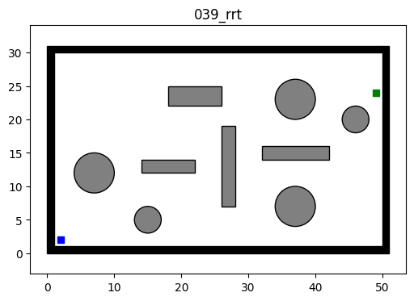
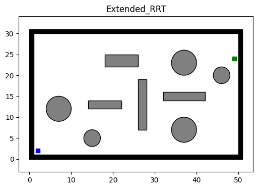
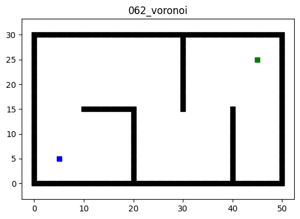

# 100pathfinding-algorithms

I am very interested in further summarizing all the pathfinding algorithms.

## Quick Start  
python3.12 or 3.13
pip install matplotlib   
pip install scipy

## Thanks

ZJU Prof. FeiGao

Some code references

https://github.com/zhm-real/PathPlanning

https://github.com/ai-winter/ros_motion_planning

## Warning
AI assistance has been used in this article

Claude 3.7/4, Doubao, ChatGPT for in-depth research and Manus.

2026-05-17 iteration: updated with Codex and ChatGPT 5.5.

Manual review and inspection.

## License

This project is licensed under the Apache License, Version 2.0.

When redistributing this project or substantial portions of it, you must keep
the copyright notice, the `LICENSE` file, and the `NOTICE` attribution file as
required by Apache-2.0.

Required attribution: `100pathfinding-algorithms by bailehang`.

-------------------

# Contents

<strong>一、图搜索算法 (Graph Search Algorithms)</strong>

基础搜索 (Uninformed Search)

- 广度优先搜索 (Breadth-First Searching - BFS)
- 深度优先搜索 (Depth-First Search - DFS)

最短路径与启发式搜索 (Shortest Path & Heuristic Search)

- 最佳优先搜索 (Greedy Best-First Search - GBFS)
- Dijkstra 算法
- Bellman-Ford 算法
- SPFA 算法
- Flow Fields（流场寻路）
- A* 算法 (A* Algorithm)
  - 传统 A*
  - A* 变体与扩展
    - 加权 A* (Weighted A*)
    - 双向 A* (Bidirectional A*)
    - 分层 A* (Hierarchical A* - HPA*)
    - 并行 A* (Parallel A*)

实时/动态启发式搜索

- LRTA* (Learning Real-time A*)
- D* 家族
  - D* (Dynamic A*)
  - Focused D*
  - D* Lite
  - Anytime D*
- LPA* (Lifelong Planning A*)
- ARA* (Anytime Repairing A*)
- RTAA* (Real-time Adaptive A*)

任意角度路径规划

- Theta* 家族
  - Theta*
  - Lazy Theta*
  - S-Theta*
  - Enhanced Theta*
  - Adaptive Theta*
- Field D*
- 导航网格任意角规划 (Navmesh Any-Angle Pathfinding)
  - Polyanya
- JPS 家族
  - JPS (Jump Point Search)
  - JPS+
  - JPS++
  - 欧几里得 JPS (Euclidean JPS - EJPS)
  - 分层 JPS (Hierarchical JPS - HJPS)
  - 动态 JPS (Dynamic JPS)
  - JPS-Lite
  - 自适应 JPS (Adaptive JPS)

- 格网规划 (Lattice Planning)

<strong>二、基于采样的路径规划 (Sampling-Based Path Planning)</strong>

- 随机路径规划 (Random Path Planning - RPP)
- 快速扩展随机树 (Rapidly-Exploring Random Trees - RRT)
  - 基础 RRT (Basic RRT)
  - 目标偏向 RRT (Goal-bias RRT)
  - RRT-Connect
  - 动态 RRT (Dynamic RRT)
  - RRT-Dubins (考虑运动学约束)
- 最优快速扩展随机树 (Optimal RRTs)
  - RRT*
  - Informed RRT*

<strong>三、智能优化算法 (Intelligent Optimization Algorithms)</strong>

- 蚁群优化 (Ant Colony Optimization - ACO)
- 遗传算法 (Genetic Algorithm - GA)
- 粒子群优化 (Particle Swarm Optimization - PSO)

<strong>四、反应式与几何规划 (Reactive & Geometric Planning)</strong>

- 人工势场法 (Artificial Potential Field - APF)
- 动态窗口法 (Dynamic Window Approach - DWA)
- 向量场直方图 (Vector Field Histogram - VFH)
- Voronoi 图方法
  - 基础 Voronoi 图 (Basic Voronoi Diagram)
  - Voronoi 场 (Voronoi Field)
  - 加权 Voronoi 图 (Weighted Voronoi Diagram)
  - 模糊 Voronoi 图 (Fuzzy Voronoi Diagram)
  - 自适应 Voronoi 场 (Adaptive Voronoi Field)

<strong>五、基于曲线与运动学的规划 (Curve-Based & Kinematic Planning)</strong>

- 多项式曲线 (Polynomial Curves)
- 贝塞尔曲线 (Bezier Curves)
- 样条曲线 (Spline Curves)
  - 三次样条曲线 (Cubic Spline)
  - B样条曲线 (B-Spline)
- 时间弹性带 (Timed Elastic Band - TEB)
- Dubins 曲线 (Dubins Curves)
- Reeds-Shepp 曲线 (Reeds-Shepp Curves)
- 特定应用优化
  - Hybrid A*
- 车辆路径问题 (Vehicle Routing Problem - VRP)

<strong>六、基于模型的控制与规划 (Model-Based Control & Planning)</strong>

- PID 控制器 (PID Controller - for path following)
- 线性二次型调节器 (Linear Quadratic Regulator - LQR)
- 模型预测控制 (Model Predictive Control - MPC)

<strong>七、多智能体路径规划 (Multi-Agent Path Finding - MAPF)</strong>

基于速度障碍 (VO) 的方法

- 速度障碍 (VO)
- 相互速度障碍 (Reciprocal Velocity Obstacles - RVO)
- 混合相互速度障碍 (Hybrid Reciprocal Velocity Obstacles - HRVO)
- 最优相互碰撞避免 (Optimal Reciprocal Collision Avoidance - ORCA)
- 行人最优相互碰撞避免 (Pedestrian ORCA - PORCA)
- 椭圆相互速度障碍 (Elliptical Reciprocal Velocity Obstacles - ERVO / EORCA)

基于搜索的冲突解决

- 冲突驱动搜索 (Conflict-Based Search - CBS)
- 分层协作 A* (Hierarchical Cooperative A* - HCA*)
- 窗口化分层协作 A* (Windowed HCA* - WHCA*)

<strong>八、其他规划方法 (Other Planning Methods)</strong>

- 凸集图规划 (Graph of Convex Sets - GCS / GCS*)

---

## 一、图搜索算法 (Graph Search Algorithms)
-   **基础搜索 (Uninformed Search)**
    -   **001 广度优先搜索 (Breadth-First Searching - BFS)**
        -   Moore (1959), Lee (1961)
        -   
        -   Path length: 54.042; Algorithm time: 13.400 ms (Algorithm-only, no animation/GIF)
        -   算法心得：
        逐层扩展的搜索策略，它从起始节点开始，逐层向外扩展，直到找到目标节点或遍历完整个搜索空间。
    -   **002 深度优先搜索 (Depth-First Search - DFS)**
        -   Trémaux (1882), Hopcroft & Tarjan (1973)
        -   
        -   Path length: 89.213; Algorithm time: 1.337 ms (Algorithm-only, no animation/GIF)
        -   算法心得：
        从起始节点开始，沿着一条路径尽可能深入，直到无法继续前进，然后回溯到上一个节点，继续探索其他路径。
-   **最短路径与启发式搜索 (Shortest Path & Heuristic Search)**
    -   **003 贪婪最佳优先搜索 (Greedy Best-First Search - GBFS)**
        -   Doran & Michie (1966), Pearl (1984)
        -   
        -   Path length: 67.255; Algorithm time: 5.040 ms (Algorithm-only, no animation/GIF)
        - 算法心得：
        从起始节点开始，每次选择与目标节点最近的节点进行扩展，直到找到目标节点或遍历完整个搜索空间。
    -   **004 Dijkstra 算法**
        -   Dijkstra (1959)
        -   
        -   Path length: 54.042; Algorithm time: 9.098 ms (Algorithm-only, no animation/GIF)
        -   算法心得：
        Dijkstra 算法是一种用于寻找最短路径的算法，它通过维护一个距离表来记录从起始节点到其他节点的最短距离。
        算法从起始节点开始，每次选择距离表中距离最小的节点进行扩展，更新其相邻节点的距离表，直到找到目标节点或遍历完整个搜索空间。
    -   **005 Bellman-Ford 算法**
        -   Bellman (1958), Ford (1956)
        -   
        -   Path length: 54.042; Algorithm time: 19.288 ms (Algorithm-only, no animation/GIF)
        -   算法心得：
        Bellman-Ford 通过反复松弛所有边来求单源最短路径，速度通常慢于 Dijkstra，但可以处理负权边并检测负权环。
    -   **006 SPFA 算法**
        -   Moore (1959), Bellman-Ford queue optimization
        -   
        -   Path length: 54.042; Algorithm time: 7.171 ms (Algorithm-only, no animation/GIF)
        -   算法心得：
        SPFA 使用队列只传播距离发生变化的节点，是 Bellman-Ford 的常见队列优化版本，在许多稀疏图上能减少无效松弛。
    -   **007 Flow Fields（流场寻路）**
        -   Treuille, Cooper, Popović (2006), 常用于 RTS/Game AI 群体寻路
        -   
        -   Path length: 54.042; Algorithm time: 13.749 ms (Algorithm-only, no animation/GIF)
        -   算法心得：
        Flow Fields 先从目标点反向传播总代价，得到 integration field，再让每个可行格子指向代价最低的邻居。多个智能体共享同一目标时，只需复用这张方向场即可快速前进。
    -   **008 A\* 算法 (A\* Algorithm)**
        -   Hart, Nilsson, Raphael (1968)
        -   
        -   Path length: 54.042; Algorithm time: 4.956 ms (Algorithm-only, no animation/GIF)
        -   算法心得：
        A\* 算法是一种启发式搜索算法，它结合了广度优先搜索和贪婪最佳优先搜索的优点。
        算法从起始节点开始，每次选择距离表中距离最小的节点进行扩展，更新其相邻节点的距离表，直到找到目标节点或遍历完整个搜索空间。
    -   **A\* 变体与扩展 (A\* Variants & Extensions)**
        -   **009 双向 A\* (Bidirectional A\*)**
            -   Pohl (1971)
            -   
            -   Path length: 54.042; Algorithm time: 3.558 ms (Algorithm-only, no animation/GIF)
            -   算法心得：
            它从起始节点和目标节点同时开始进行搜索，直到两个搜索方向相遇。
        
        -   **010 加权 A\* (Weighted A\*)**
            -   Pohl (1970)
            -   
            -   Path length: 57.355; Algorithm time: 6.071 ms (Algorithm-only, no animation/GIF)
            -   算法心得：
            加权 A\* 算法是 A\* 算法的一种变体，它通过对每个节点的代价进行加权来调整搜索过程。
        -   **011 分层 A\* (Hierarchical A\* - HPA\*)**
            -   Botea, Müller, Schaeffer (2004)
            -   
            -   Path length: 51.632; Algorithm time: 2.374 ms (Algorithm-only, no animation/GIF)
            -   算法心得：
            分层 A\* 算法是 A\* 算法的一种变体，它将搜索空间划分为多个层次，每个层次使用 A\* 算法进行搜索。这里展示两个层次。
        -   **012 并行 A\* (Parallel A\*)**
            -   Zhou & Zeng (2015)
            -   
            -   Path length: total 142.083, avg 47.361, n=3; Algorithm time: 60.805 ms (Algorithm-only, no animation/GIF)
            -   算法心得：
            并行 A\* 算法的优点是可以利用多核处理器的并行计算能力，加快搜索速度。这里难以展示这种并行改为展示多个终点复用查询路径的情况
        -   **013 Hybrid A\***
            -   Dolgov, Thrun, Montemerlo, Diebel (2008)
            -   
            -   算法心得：
            混合 A\* 算法有运动约束的寻路，比如汽车的运动约束，
    -   **实时/动态启发式搜索 (Real-time/Dynamic Heuristic Search)**
        -   **014 LRTA\* (Learning Real-time A\*)**
            -   Korf (1990)
            -  
            -   算法心得：
            学习式 A\* 算法是 A\* 算法的一种变体，它通过学习来调整搜索过程。
        -   **015 Repairing A\***
            -  Stentz (1994)
            -  
            -   算法心得：
            修复 A\* 算法是 A\* 算法的一种变体，也是D\*，动态环境下它通过修复搜索过程中的错误来提高搜索效率。
        -   **016 LPA\* (Lifelong Planning A\*)**
            -   Koenig, Likhachev, Furcy (2004)
            -   
            -    算法心得：
            终身规划 A\* 算法是 A\* 算法的一种变体，它可以在不断变化的环境中进行搜索。
        -   **017 ARA\* (Anytime Repairing A\*)**
            -   Likhachev, Gordon, Thrun (2003)
            -  
            -   算法心得：
             anytime Repairing A\* 算法是 A\* 算法的一种变体，初始权重较大，路径接近 “次优解”，算法的 “修复” 机制多次调整，self.e -= 0.5。
        -   **018 RTAA\* (Real-time Adaptive A\*)**
            -   Koenig & Likhachev (2006)
            - 
            -   算法心得：
            实时自适应 A\* 算法是 A\* 算法的一种变体，它可以在不断变化的环境中进行搜索。
        -   **D\* 家族 (D\* Family)**
            -   **019 D\* (Dynamic A\*)**
                -   Stentz (1994)
                -  
                -   算法心得：
                也叫做动态 A\* 算法
            -   **020 Lazy D\***
                -   Koenig, Likhachev, Furcy (2004)
            -   **021 Focused D\***
                -   Stentz (1995)
            -   **022 D\* Lite**
                -   Koenig & Likhachev (2002)
            -   **023 Anytime D\***
                -   Likhachev, Ferguson, Gordon, Stentz, Thrun (2005)
                - 
            -   **024 Field D\***
                -   Ferguson & Stentz (2007)
  
    -   **任意角度路径规划 (Any-Angle Path Planning)**
        -   **ThetA\* 家族 (ThetA\* Family)**
            -   **025 ThetA\***
                -   Nash, Daniel, Koenig, Felner (2007)
                -   
            -   **026 Lazy ThetA\***
                -   Nash, Koenig, Tovey (2010)
                -  
            -   **027 S-ThetA\***
                -   Tang, Chen, Wu, Zhang, Chen (2021)
                -  
            -   **028 Enhanced ThetA\***
                -   Li, Wen, Wang, Zhang (2020)
                - 
            -   **029 Multi - Agent Theta**
                -   Li, Zhang, Wang, Zhang (2022)
            -   **030 Adaptive ThetA\***
                -   Ferguson & Stentz (2006)
        -   **导航网格任意角规划 (Navmesh Any-Angle Pathfinding)**
            -   **031 Polyanya**
                -   Cui, Harabor, Grastien (2017)
                -   
                -   算法心得：
                Polyanya 在导航网格上搜索“根点 + 边界区间”，用可见区间传播代替逐格扩展，可得到更接近连续空间最短路径的任意角路线。
        -   **JPS 家族 (Jump Point Search Family)**
            -   **032 JPS (Jump Point Search)**
                -   Harabor & Grastien (2011)
                -  
            -   **033 JPS+**
                -   Harabor & Grastien (2012)
            -   **034 JPS++**
                -   Pochter, Zohar, Rosenschein, Sturtevant (2012)
            -   **035 欧几里得 JPS (Euclidean JPS - EJPS)**
                -   Strasser, Botea, Harabor (2016)
            -   **036 分层 JPS (Hierarchical JPS - HJPS)**
                -   Harabor & Grastien (2014)
            -   **037 动态 JPS (Dynamic JPS)**
                -   Papadakis (2013)
            -   **038 JPS-Lite**
                -   Gong, Zhang, Wang, Wang (2019)
            -   **039 Multi - Agent ThetA\**
                -   Li, Zhang, Wang, Zhang (2022)
            -   **040 自适应 JPS (Adaptive JPS)**
                -   Su, Hsueh (2016)
    -   **041 格网规划 (Lattice Planning)**
        -   Pivtoraiko, Kelly (2005), Likhachev & Ferguson (2009)

## 二、基于采样的路径规划 (Sampling-Based Path Planning)
-   **042 随机路径规划 (Random Path Planning - RPP)**
    -   Barraquand & Latombe (1991)
-   **快速扩展随机树 (Rapidly-Exploring Random Trees - RRT)**
    -   **043 基础 RRT (Basic RRT)**
        -   LaValle (1998)
        -   
    -   **044 目标偏向 RRT (Goal-bias RRT)**
        -   LaValle & Kuffner (2001) 
        -   
    -   **045 RRT-Connect**
        -   Kuffner & LaValle (2000)
        -   
    -   **046 动态 RRT (Dynamic RRT)**
        -   Ferguson, Howard, Likhachev (2008)
    -   **047 RRT-Dubins (考虑运动学约束)**
        -   LaValle & Kuffner (2001) (Dubins with RRT)
-   **最优快速扩展随机树 (Optimal RRTs)**
    -   **048 rrt star**
        -   Karaman & Frazzoli (2011)
    -   **049 rrt start smart**
        -  Nasir, K., et al. (2013)
    -   **050 rrt sharp**
        -  Otte & Frazzoli (2014)
    -   **051 Informed RRT\***
        -  Gammell, Srinivasa & Barfoot (2014)
    -   **052 FMT\***
        -  Janson, Schmerling, Clark & Pavone (2015)
    -   **053 BIT\* batch informed trees**
        -  Gammell, Srinivasa & Barfoot (2015)
    -   **054 ABIT\* advanced batch informed trees**
        -  Strub & Gammell (2020)
    -   **055 AIT\* (Adaptively Informed Trees)**
        -  Strub & Gammell (2020)
    -   **056 Anytime-RRT\***
        -   Karaman, Walter, Perez, Frazzoli & Teller (2011)
    -   **057 Closed-loop RRT\* (CL-RRT\*)**
        -   Luders, Kothari & How (2010)
    -   **058 Spline-RRT\***
        -   Lee, Song & Shim (2014)
    -   **059 LQR-RRT\****
        -   Perez, Platt, Konidaris, Kaelbling & Lozano-Perez (2012)

## 三、智能优化算法 (Intelligent Optimization Algorithms)
-   **060 蚁群优化 (Ant Colony Optimization - ACO)**
    -   Dorigo, Maniezzo, Colorni (1991, 1996), Dorigo & Di Caro (1999)
-   **061 遗传算法 (Genetic Algorithm - GA)**
    -   Holland (1975/1992)
-   **062 粒子群优化 (Particle Swarm Optimization - PSO)**
    -   Kennedy & Eberhart (1995)

## 四、反应式与几何规划 (Reactive & Geometric Planning)
-   **063 人工势场法 (Artificial Potential Field - APF)**
    -   Khatib (1986)
-   **064 动态窗口法 (Dynamic Window Approach - DWA)**
    -   Fox, Burgard, Thrun (1997)
-   **065 向量场直方图 (Vector Field Histogram - VFH)**
    -   Borenstein & Koren (1991)
-   **Voronoi 图方法 (Voronoi Diagram Methods)**
    -   **066 基础 Voronoi 图 (Basic Voronoi Diagram)**
        -   Voronoi (1908), Shamos & Hoey (1975) 
        -   
    -   **067 Voronoi 场 (Voronoi Field)**
        -   Okabe, Boots, Sugihara, Chiu (2000) 
    -   **068 加权 Voronoi 图 (Weighted Voronoi Diagram)**
        -   Aurenhammer & Edelsbrunner (1984)
    -   **069 模糊 Voronoi 图 (Fuzzy Voronoi Diagram)**
        -   Jooyandeh, Mohades Khorasani (2008)
    -   **070 自适应 Voronoi 场 (Adaptive Voronoi Field)**
        -   Garrido, Moreno, Blanco, Medina (2010)

## 五、基于曲线与运动学的规划 (Curve-Based & Kinematic Planning)
-   **071 多项式曲线 (Polynomial Curves)**
    -   Richter, Bry, Roy (2013)
-   **072 贝塞尔曲线 (Bezier Curves)**
    -   Bezier (1960s), Forrest (1972)
-   **样条曲线 (Spline Curves)**
    -   **073 三次样条曲线 (Cubic Spline)**
        -   Ahlberg, Nilson, Walsh (1967)
    -   **074 B样条曲线 (B-Spline)**
        -   de Boor (1972), Cox (1972)
-   **075 时间弹性带 (Timed Elastic Band - TEB)**
    -   Rösmann, Hoffmann, Bertram (2012, 2017)
-   **076 Dubins 曲线 (Dubins Curves)**
    -   Dubins (1957)
-   **077 Reeds-Shepp 曲线 (Reeds-Shepp Curves)**
    -   Reeds & Shepp (1990)
-   **078 车辆路径问题 (Vehicle Routing Problem - VRP)**
    -   Dantzig & Ramser (1959)

## 六、基于模型的控制与规划 (Model-Based Control & Planning)
-   **079 PID 控制器 (PID Controller - for path following)**
    -   Minorsky (1922), Ziegler & Nichols (1942)
-   **080 线性二次型调节器 (Linear Quadratic Regulator - LQR)**
    -   Kalman (1960)
-   **081 模型预测控制 (Model Predictive Control - MPC)**
    -   Cutler & Ramaker (1980), Garcia, Prett, Morari (1989)

## 七、多智能体路径规划 (Multi-Agent Path Finding - MAPF)
-   **基于速度障碍 (Velocity Obstacle - VO) 的方法**
    -   **082 速度障碍 (VO)**
        -   Fiorini & Shiller (1998)
    -   **083 相互速度障碍 (Reciprocal Velocity Obstacles - RVO)**
        -   van den Berg, Lin, Manocha (2008)
    -   **084 混合相互速度障碍 (Hybrid Reciprocal Velocity Obstacles - HRVO)**
        -   Snape, van den Berg, Guy, Manocha (2011)
    -   **085 最优相互碰撞避免 (Optimal Reciprocal Collision Avoidance - ORCA)**
        -   van den Berg, Guy, Lin, Manocha (2008, 2011)
    -   **086 行人最优相互碰撞避免 (Pedestrian ORCA - PORCA)**
        -   Luo, Cai, Bera, Hsu, Lee, Manocha (2018)
    -   **087 椭圆相互速度障碍 (Elliptical Reciprocal Velocity Obstacles - ERVO / EORCA)**
        -   Best, Narang, Manocha (2016)
-   **基于搜索的冲突解决 (Search-Based Conflict Resolution)**
    -   **088 冲突驱动搜索 (Conflict-Based Search - CBS)**
        -   Sharon, Stern, Felner, Sturtevant (2012, 2015)
    -   **089 分层协作 A\* (Hierarchical Cooperative A\* - HCA\*)**
        -   Silver (2005)
    -   **090 窗口化分层协作 A\* (Windowed HCA\* - WHCA\*)**
        -   Silver (2005)
-   **基于社会力模型 (Social Force) 的方法**
    -   **091 UE5 AI Avoidance**
        -   UE5 MassAI MassAvoidanceProcessors (2023)
## 八、其他规划方法 (Other Planning Methods)
-   **092 凸集图规划 (Graph of Convex Sets - GCS / GCS\*)**
    -   Marcucci, Tedrake (2019), Chia, Jiang, Graesdal, Kaelbling, Tedrake (2024)
    -   
-   **093 多智能体凸集图规划 (Multi-Agent Graph of Convex Sets - MGCS / MGCS\*)**
    -   Marcucci, Tedrake (2019), Chia, Jiang, Graesdal, Kaelbling, Tedrake (2024)
-   **094 多智能体多目标规划 (Multi-Agent Multi-Objective Planning - MAMOP)**
    -   Chia, Jiang, Graesdal, Kaelbling, Tedrake (2024)

