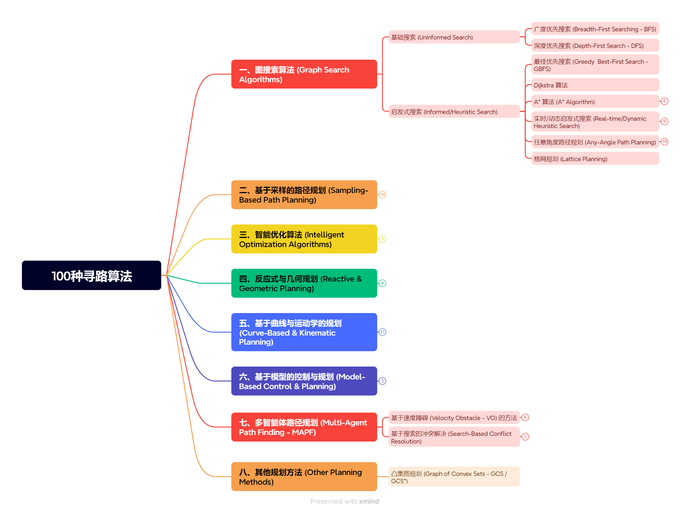

# 100pathfinding-algorithms

I am very interested in further summarizing all the pathfinding algorithms.

## Quick Start  
pip install matplotlib   #python3.12

## Thanks

ZJU Prof. FeiGao

Some code references

https://github.com/zhm-real/PathPlanning

https://github.com/ai-winter/ros_motion_planning

## Warning
AI assistance has been used in this article

Claude 3.7/4, Doubao, ChatGPT for in-depth research and Manus.

Manual review and inspection.

-------------------

# Contents

## 一、图搜索算法 (Graph Search Algorithms)
-   **基础搜索 (Uninformed Search)**
    -   **001 广度优先搜索 (Breadth-First Searching - BFS)**
        -   Moore (1959), Lee (1961)
        -   
        -   算法心得：
        逐层扩展的搜索策略，它从起始节点开始，逐层向外扩展，直到找到目标节点或遍历完整个搜索空间。
    -   **002 深度优先搜索 (Depth-First Search - DFS)**
        -   Trémaux (1882), Hopcroft & Tarjan (1973)
        -   
        -   算法心得：
        从起始节点开始，沿着一条路径尽可能深入，直到无法继续前进，然后回溯到上一个节点，继续探索其他路径。
-   **启发式搜索 (Informed/Heuristic Search)**
    -   **003 贪婪最佳优先搜索 (Greedy Best-First Search - GBFS)**
        -   Doran & Michie (1966), Pearl (1984)
        -   
        - 算法心得：
        从起始节点开始，每次选择与目标节点最近的节点进行扩展，直到找到目标节点或遍历完整个搜索空间。
    -   **004 Dijkstra 算法**
        -   Dijkstra (1959)
        -   
        -   算法心得：
        Dijkstra 算法是一种用于寻找最短路径的算法，它通过维护一个距离表来记录从起始节点到其他节点的最短距离。
        算法从起始节点开始，每次选择距离表中距离最小的节点进行扩展，更新其相邻节点的距离表，直到找到目标节点或遍历完整个搜索空间。
    -   **005 A* 算法 (A* Algorithm)**
        -   Hart, Nilsson, Raphael (1968)
        -   
        -   算法心得：
        A* 算法是一种启发式搜索算法，它结合了广度优先搜索和贪婪最佳优先搜索的优点。
        算法从起始节点开始，每次选择距离表中距离最小的节点进行扩展，更新其相邻节点的距离表，直到找到目标节点或遍历完整个搜索空间。
    -   **A* 变体与扩展 (A* Variants & Extensions)**
        -   **006 双向 A* (Bidirectional A*)**
            -   Pohl (1971)
            -   
            -   算法心得：
            它从起始节点和目标节点同时开始进行搜索，直到两个搜索方向相遇。
        
        -   **007 加权 A* (Weighted A*)**
            -   Pohl (1970)
            -   
            -   算法心得：
            加权 A* 算法是 A* 算法的一种变体，它通过对每个节点的代价进行加权来调整搜索过程。
        -   **008 分层 A* (Hierarchical A* - HPA*)**
            -   Botea, Müller, Schaeffer (2004)
            -   
            -   算法心得：
            分层 A* 算法是 A* 算法的一种变体，它将搜索空间划分为多个层次，每个层次使用 A* 算法进行搜索。这里展示两个层次。
        -   **009 并行 A* (Parallel A*)**
            -   Zhou & Zeng (2015)
            -   
            -   算法心得：
            并行 A* 算法的优点是可以利用多核处理器的并行计算能力，加快搜索速度。这里难以展示这种并行改为展示多个终点复用查询路径的情况
        -   **010 Hybrid A* **
            -   Dolgov, Thrun, Montemerlo, Diebel (2008)
            -   
            -   算法心得：
            混合 A* 算法有运动约束的寻路，比如汽车的运动约束，
    -   **实时/动态启发式搜索 (Real-time/Dynamic Heuristic Search)**
        -   **011 LRTA* (Learning Real-time A*)**
            -   Korf (1990)
            -  
            -   算法心得：
            学习式 A* 算法是 A* 算法的一种变体，它通过学习来调整搜索过程。
        -   **012 Repairing A* **
            -  Stentz (1994)
            -  
            -   算法心得：
            修复 A* 算法是 A* 算法的一种变体，也是D*，动态环境下它通过修复搜索过程中的错误来提高搜索效率。
        -   **013 LPA* (Lifelong Planning A*)**
            -   Koenig, Likhachev, Furcy (2004)
            -   
            -    算法心得：
            终身规划 A* 算法是 A* 算法的一种变体，它可以在不断变化的环境中进行搜索。
        -   **014 ARA* (Anytime Repairing A*)**
            -   Likhachev, Gordon, Thrun (2003)
            -  
            -   算法心得：
             anytime Repairing A* 算法是 A* 算法的一种变体，初始权重较大，路径接近 “次优解”，算法的 “修复” 机制多次调整，self.e -= 0.5。
        -   **015 RTAA* (Real-time Adaptive A*)**
            -   Koenig & Likhachev (2006)
            - 
            -   算法心得：
            实时自适应 A* 算法是 A* 算法的一种变体，它可以在不断变化的环境中进行搜索。
        -   **D* 家族 (D* Family)**
            -   **016 D* (Dynamic A*)**
                -   Stentz (1994)
                -  
                -   算法心得：
                也叫做动态 A* 算法
            -   **017 Lazy D* **
                -   Koenig, Likhachev, Furcy (2004)
            -   **018 Focused D* **
                -   Stentz (1995)
            -   **019 D* Lite**
                -   Koenig & Likhachev (2002)
            -   **020 Anytime D* **
                -   Likhachev, Ferguson, Gordon, Stentz, Thrun (2005)
                - 
            -   **021 Field D* **
                -   Ferguson & Stentz (2007)
  
    -   **任意角度路径规划 (Any-Angle Path Planning)**
        -   **Theta* 家族 (Theta* Family)**
            -   **022 Theta* **
                -   Nash, Daniel, Koenig, Felner (2007)
                -   
            -   **023 Lazy Theta* **
                -   Nash, Koenig, Tovey (2010)
                -  
            -   **024 S-Theta* **
                -   Tang, Chen, Wu, Zhang, Chen (2021)
                -  
            -   **025 Enhanced Theta* **
                -   Li, Wen, Wang, Zhang (2020)
                - 
            -   **026 Multi - Agent Theta **
                -   Li, Zhang, Wang, Zhang (2022)
            -   **027 Adaptive Theta* **
                -   Ferguson & Stentz (2006)
        -   **JPS 家族 (Jump Point Search Family)**
            -   **028 JPS (Jump Point Search)**
                -   Harabor & Grastien (2011)
            -   **029 JPS+**
                -   Harabor & Grastien (2012)
            -   **030 JPS++**
                -   Pochter, Zohar, Rosenschein, Sturtevant (2012)
            -   **031 欧几里得 JPS (Euclidean JPS - EJPS)**
                -   Strasser, Botea, Harabor (2016)
            -   **032 分层 JPS (Hierarchical JPS - HJPS)**
                -   Harabor & Grastien (2014)
            -   **033 动态 JPS (Dynamic JPS)**
                -   Papadakis (2013)
            -   **034 JPS-Lite**
                -   Gong, Zhang, Wang, Wang (2019)
            -   **035 Multi - Agent Theta**
                -   Li, Zhang, Wang, Zhang (2022)
            -   **036 自适应 JPS (Adaptive JPS)**
                -   Su, Hsueh (2016)
    -   **037 格网规划 (Lattice Planning)**
        -   Pivtoraiko, Kelly (2005), Likhachev & Ferguson (2009)

## 二、基于采样的路径规划 (Sampling-Based Path Planning)
-   **038 随机路径规划 (Random Path Planning - RPP)**
    -   Barraquand & Latombe (1991)
-   **快速扩展随机树 (Rapidly-Exploring Random Trees - RRT)**
    -   **039 基础 RRT (Basic RRT)**
        -   LaValle (1998)
    -   **040 目标偏向 RRT (Goal-bias RRT)**
        -   LaValle & Kuffner (2001) 
    -   **041 RRT-Connect**
        -   Kuffner & LaValle (2000)
    -   **042 动态 RRT (Dynamic RRT)**
        -   Ferguson, Howard, Likhachev (2008)
    -   **043 RRT-Dubins (考虑运动学约束)**
        -   LaValle & Kuffner (2001) (Dubins with RRT)
-   **最优快速扩展随机树 (Optimal RRTs)**
    -   **044 rrt star**
        -  TODO
    -   **045 rrt start smart**
        -  TODO
    -   **046 rrt sharp**
        -  TODO
    -   **047 Informed RRT* ***
        -   TODO
    -   **048 FMT* ***
        -   TODO
    -   **049 BIT* batch informed trees**
        -   TODO
    -   **050 ABIT* advanced batch informed trees**
        -   TODO
    -   **051 Adaptively Informed Trees (AIT*)**
        -   TODO
    -   **052 Anytime-RRT***
        -   TODO
    -   **053 Closed-loop RRT* (CL-RRT*)**
        -   TODO
    -   **054 Spline-RRT***
        -   TODO
    -   **055 LQR-RRT****
        -   TODO

## 三、智能优化算法 (Intelligent Optimization Algorithms)
-   **056 蚁群优化 (Ant Colony Optimization - ACO)**
    -   Dorigo, Maniezzo, Colorni (1991, 1996), Dorigo & Di Caro (1999)
-   **057 遗传算法 (Genetic Algorithm - GA)**
    -   Holland (1975/1992)
-   **058 粒子群优化 (Particle Swarm Optimization - PSO)**
    -   Kennedy & Eberhart (1995)

## 四、反应式与几何规划 (Reactive & Geometric Planning)
-   **059 人工势场法 (Artificial Potential Field - APF)**
    -   Khatib (1986)
-   **060 动态窗口法 (Dynamic Window Approach - DWA)**
    -   Fox, Burgard, Thrun (1997)
-   **061 向量场直方图 (Vector Field Histogram - VFH)**
    -   Borenstein & Koren (1991)
-   **Voronoi 图方法 (Voronoi Diagram Methods)**
    -   **062 基础 Voronoi 图 (Basic Voronoi Diagram)**
        -   Voronoi (1908), Shamos & Hoey (1975) 
    -   **063 Voronoi 场 (Voronoi Field)**
        -   Okabe, Boots, Sugihara, Chiu (2000) 
    -   **064 加权 Voronoi 图 (Weighted Voronoi Diagram)**
        -   Aurenhammer & Edelsbrunner (1984)
    -   **065 模糊 Voronoi 图 (Fuzzy Voronoi Diagram)**
        -   Jooyandeh, Mohades Khorasani (2008)
    -   **066 自适应 Voronoi 场 (Adaptive Voronoi Field)**
        -   Garrido, Moreno, Blanco, Medina (2010)

## 五、基于曲线与运动学的规划 (Curve-Based & Kinematic Planning)
-   **067 多项式曲线 (Polynomial Curves)**
    -   Richter, Bry, Roy (2013)
-   **068 贝塞尔曲线 (Bezier Curves)**
    -   Bezier (1960s), Forrest (1972)
-   **样条曲线 (Spline Curves)**
    -   **069 三次样条曲线 (Cubic Spline)**
        -   Ahlberg, Nilson, Walsh (1967)
    -   **070 B样条曲线 (B-Spline)**
        -   de Boor (1972), Cox (1972)
-   **071 时间弹性带 (Timed Elastic Band - TEB)**
    -   Rösmann, Hoffmann, Bertram (2012, 2017)
-   **072 Dubins 曲线 (Dubins Curves)**
    -   Dubins (1957)
-   **073 Reeds-Shepp 曲线 (Reeds-Shepp Curves)**
    -   Reeds & Shepp (1990)
-   **074 车辆路径问题 (Vehicle Routing Problem - VRP)**
    -   Dantzig & Ramser (1959)

## 六、基于模型的控制与规划 (Model-Based Control & Planning)
-   **075 PID 控制器 (PID Controller - for path following)**
    -   Minorsky (1922), Ziegler & Nichols (1942)
-   **076 线性二次型调节器 (Linear Quadratic Regulator - LQR)**
    -   Kalman (1960)
-   **077 模型预测控制 (Model Predictive Control - MPC)**
    -   Cutler & Ramaker (1980), Garcia, Prett, Morari (1989)

## 七、多智能体路径规划 (Multi-Agent Path Finding - MAPF)
-   **基于速度障碍 (Velocity Obstacle - VO) 的方法**
    -   **078 速度障碍 (VO)**
        -   Fiorini & Shiller (1998)
    -   **079 相互速度障碍 (Reciprocal Velocity Obstacles - RVO)**
        -   van den Berg, Lin, Manocha (2008)
    -   **080 混合相互速度障碍 (Hybrid Reciprocal Velocity Obstacles - HRVO)**
        -   Snape, van den Berg, Guy, Manocha (2011)
    -   **081 最优相互碰撞避免 (Optimal Reciprocal Collision Avoidance - ORCA)**
        -   van den Berg, Guy, Lin, Manocha (2008, 2011)
    -   **082 行人最优相互碰撞避免 (Pedestrian ORCA - PORCA)**
        -   Luo, Cai, Bera, Hsu, Lee, Manocha (2018)
    -   **083 椭圆相互速度障碍 (Elliptical Reciprocal Velocity Obstacles - ERVO / EORCA)**
        -   Best, Narang, Manocha (2016)
-   **基于搜索的冲突解决 (Search-Based Conflict Resolution)**
    -   **084 冲突驱动搜索 (Conflict-Based Search - CBS)**
        -   Sharon, Stern, Felner, Sturtevant (2012, 2015)
    -   **085 分层协作 A* (Hierarchical Cooperative A* - HCA*)**
        -   Silver (2005)
    -   **086 窗口化分层协作 A* (Windowed HCA* - WHCA*)**
        -   Silver (2005)

## 八、其他规划方法 (Other Planning Methods)
-   **087 凸集图规划 (Graph of Convex Sets - GCS / GCS*)**
    -   Marcucci, Tedrake (2019), Chia, Jiang, Graesdal, Kaelbling, Tedrake (2024)
    -   
-   **088 多智能体凸集图规划 (Multi-Agent Graph of Convex Sets - MGCS / MGCS*)**
    -   Marcucci, Tedrake (2019), Chia, Jiang, Graesdal, Kaelbling, Tedrake (2024)
-   **089 多智能体多目标规划 (Multi-Agent Multi-Objective Planning - MAMOP)**
    -   Chia, Jiang, Graesdal, Kaelbling, Tedrake (2024)

